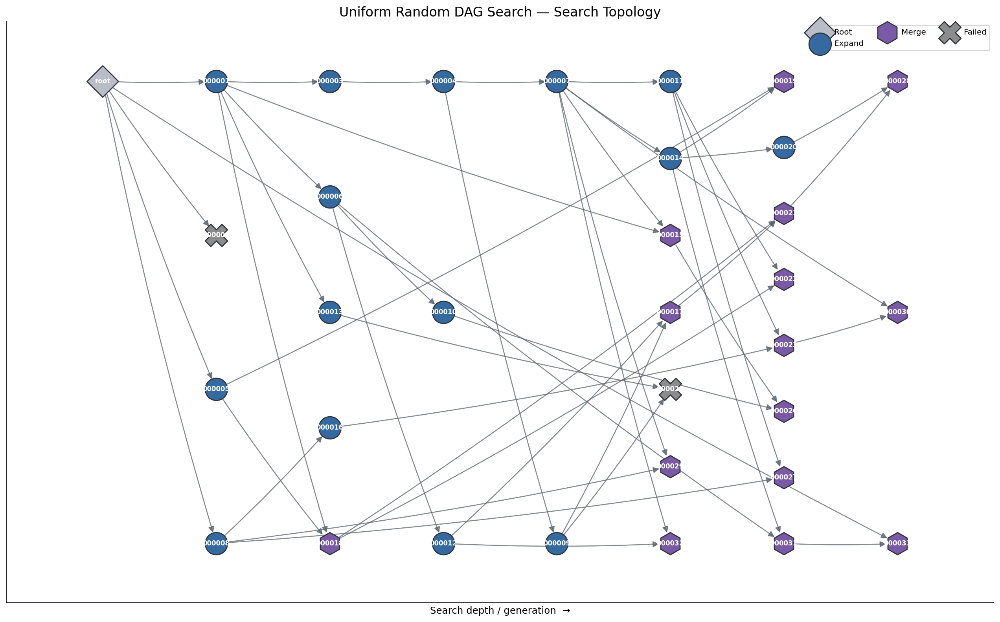
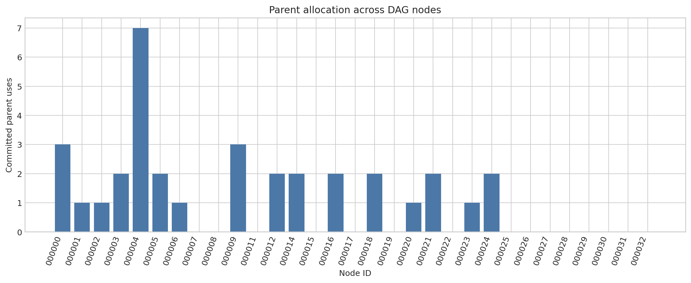

# Exploring DAG Search for Automated Research

*An exploratory study of how branching, recombination, search allocation, and proposal memory change automated program-improvement search.*

## Motivation

A linear automated-research loop edits the current program, trains and evaluates the candidate, and keeps one surviving trajectory. In the initial run here, that simple process was productive: validation bits per byte (`val_bpb`, lower is better) improved rapidly. Later iterations entered a much flatter regime. That observation—not a claim that Linear Search failed—motivated the central question:

> **After a linear search begins to flatten, what changes if historical candidates can be retained, revisited, and recombined?**


*The original Linear Search ran for 40 iterations. The standardized view shows the first 30: large early gains are followed by a flatter search phase. All 40 raw results are retained.*

## How the experiments evolved

Each stage was motivated by a limitation observed in the preceding search process. The sequence is a chain of research questions, not a performance ranking.

| Observation or question | Intervention tested | What happened | Next question |
|---|---|---|---|
| One trajectory improved quickly, then flattened. | **Linear Search** established the initial behavior. | Strong early improvement; slower later progress. | Could historical states remain useful? |
| A single chain cannot revisit alternatives. | **Uniform Random Tree Search** made every eligible candidate available for Expand. | 9/30 children improved locally; none beat the recorded root. | How should search effort be allocated? |
| A tree cannot combine branches. | **Uniform Random DAG Search** added two-parent semantic Merge. | 15 Expands and 15 Merges; no Merge beat its better parent. | Which parents and pairs deserve work? |
| Uniform sampling ignores research productivity. | **Credit-Guided Parent DAG** combined quality, direct-child improvement, and exploration. | Parent use changed, but proposals concentrated and pairs were rejected. | Can feasibility and proposal diversity be improved separately? |
| One rejected pair ended a Merge intent. | **Merge-Retry Credit-Guided DAG** tried three frozen-snapshot pairs, then fallback Expand. | 12 Merges completed versus four previously; only one improved locally. | What must the proposal agent remember? |
| A multi-node DAG can repeat one mechanism. | **Outcome-Aware Proposal-Memory DAG** added mechanism memory, outcomes, novelty checks, diversity guidance, and retries. | 18 families and 10/30 local improvements; suggestive, not causal. | Are explicit outcome labels necessary? |
| Memory mixed exploration history with outcomes. | **Outcome-Blind Proposal-Memory DAG** hid explicit outcome counts from proposal context. | Mechanism history and broad coverage remained; one run cannot identify an outcome-feedback effect. | A paired, replicated ablation is needed. |

## From one trajectory to a search graph

Tree Search made finished historical candidates eligible again. Every new candidate still had one parent, but search could branch from earlier states rather than only extending the latest survivor.


*Arrows point from parent to child. Green means the child improved over its own parent; red means it did not. The Tree run contained local recoveries, but branching alone did not recover the recorded root baseline.*

A tree cannot recombine lineages. The DAG implementation therefore introduced **Merge**: the proposal agent receives two parent states and their direct code difference, rejects redundant or conflicting pairs, or synthesizes one coherent child. Accepted Merge candidates are represented by two incoming edges.



*Blue circles are Expands, purple hexagons are two-parent Merges, and gray crosses are failed candidates. The audit found no missing nodes or invented edges.*

Merge exposed two different problems. **Feasibility** asks whether two modifications are distinct and compatible enough to combine. **Usefulness** asks whether the resulting child improves over the better parent. The experiments observed failures at both levels; richer graph structure did not guarantee better optimization.

## Allocating search effort

Once many historical nodes are retained, the problem changes from “can alternatives be preserved?” to “which alternatives deserve more experiments?” Credit-Guided Parent DAG replaced uniform sampling with a softmax over three terms:

- current candidate quality;
- mean improvement produced by its valid direct children;
- an exploration bonus for underused nodes.

This is not simply best-node selection. A candidate that is not currently best can receive credit for producing useful direct descendants. The current implementation does not propagate multi-generation credit and does not hard-prune low-credit nodes.



*Realized parent-use counts in the Credit-Guided Parent DAG. The plot shows changed allocation behavior in one adaptive run; it does not establish that the credit formula is superior.*

That run also exposed Merge starvation: 31 of 36 Merge attempts were semantically rejected. The next experiment retained the same credit rule and 50/50 Expand/Merge intent, but froze the candidate pool and credit distribution for each Merge intent, tried up to three distinct pairs, and fell back to credit-guided Expand after exhaustion. This was a feasibility repair, not a new credit algorithm. More Merges completed, but useful recombination remained rare. These were separate adaptive trajectories, so the contrast is descriptive rather than causal.

## From structural diversity to proposal diversity

The credit experiment contained many nodes yet 29/30 finished proposals concerned one learning-rate lineage. This separated two ideas that are easy to conflate: **structural diversity** means retaining different nodes and edges; **proposal diversity** means exploring genuinely different mechanisms.

Outcome-Aware Proposal-Memory DAG therefore tracked mechanism families, effective transitions, attempts, parent-relative outcomes, failures, novelty classifications, and retry context to discourage semantic repetition before training.


*A later credit-guided DAG with proposal memory. Green is strictly parent-relative: an Expand must beat its parent, and a Merge must beat the lower-BPB parent. It is not a cross-run or own-baseline success label.*

The final experiment was diagnostic, not a “best” algorithm. Outcome-Blind Proposal-Memory DAG hid explicit `beat-parent` and failure counts from the proposal agent while retaining mechanism history, novelty information, retry history, code/diff context, and structural context. The search allocator still used measured outcomes to compute parent credit. **Outcome-Blind is therefore neither history-blind nor memoryless.** Comparing its single trajectory directly with the outcome-aware run would not isolate the effect of outcome feedback.

## What the experiments taught me

1. **Linear Search was effective early, but its later flattening motivated alternative trajectories.** One run does not establish a universal plateau.
2. **Branching alone was insufficient in the observed Tree run.** Local improvements occurred, but preserving alternatives did not decide where to spend budget.
3. **Merge introduced both compatibility and optimization problems.** Retry improved access to executable pairs in its realized run; it did not make Merge reliably useful.
4. **Allocation and proposal generation are separate control problems.** Credit changed parent selection, yet could not compensate for a concentrated proposal population.
5. **Root-baseline wins are not independent discoveries.** In the outcome-blind run, 19 of 28 candidates below the recorded root were inherited successes rather than new local improvements. Parent-relative and lineage analysis prevents that distinction from disappearing.

## Evaluation audit

An exploratory outcome-aware versus outcome-blind comparison revealed mismatched baseline provenance. Rather than use it as causal evidence, I audited the baselines and ran four byte-identical calibrations under the nominal 300-second protocol. They completed **20, 21, 20, and 23 optimizer steps**, with `val_bpb` spanning **1.906045 to 1.888005** (range **0.018040**). A wall-clock budget was not a fixed optimization-exposure budget.

For that reason, this repository does not rank the seven experiments by best BPB or treat cross-run own-baseline win rates as causal effects. The analysis emphasizes within-run parent-relative improvement, topology, Merge feasibility, lineage inheritance, and proposal behavior.

## Repository and provenance

```text
autoresearch-dag/
├── experiments/                  # seven executed experiment snapshots
├── diagnostics/baseline_calibration/
├── docs/                         # naming and topology audits
├── report/                       # technical report and claim audit
└── scripts/
```

Each experiment keeps its executed core-code snapshot, compact results, figures, and notes. Repeated code intentionally preserves implementation provenance.

- [Full Technical Report](report/research_report.md)
- [Claim Audit](report/claim_audit.md)
- [Experiment Naming and Methodology](docs/naming.md)
- [Topology Figure Audit](docs/figure_audit.md)
- [Baseline Calibration](diagnostics/baseline_calibration/README.md)

## Limitations

The experiments are mostly single-seed, use small 30-candidate budgets, and were run in a single-GPU setting. Their trajectories are adaptive, proposal generation is stochastic, Merge compatibility is imperfect, and wall-clock stopping creates variable optimization exposure. The results support observations about these recorded runs and motivate further controlled experiments; they do not establish statistical significance or universal superiority of DAG search.

## Status

An exploratory independent research project documenting implemented mechanisms, negative results, and the methodological audit that changed how the results were interpreted.
