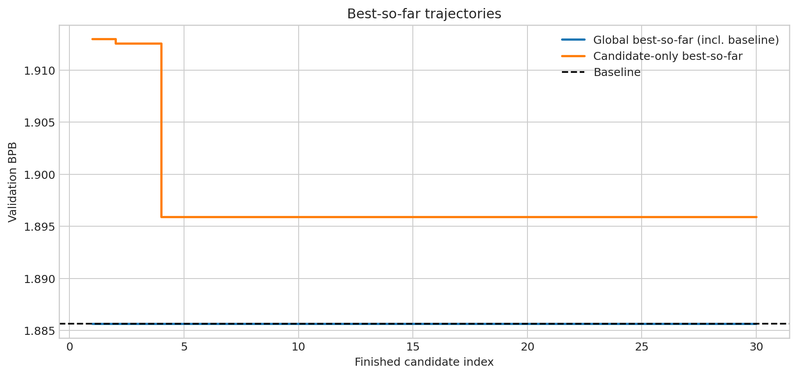
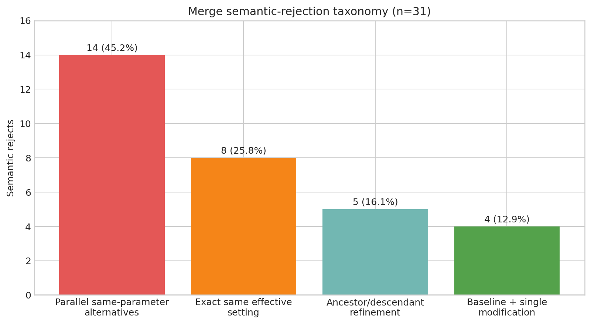

# Credit-Guided DAG-A：完整实验报告

## 摘要

本实验研究一个直接的 AutoResearch 预算分配问题：当搜索历史形成 DAG 后，是否能让更有希望的节点获得更多后续研究机会，而不是继续均匀地从所有 finished nodes 中选择 parent？Credit-Guided DAG-A 为每个可选节点综合计算当前质量、历史 child improvement 和 exploration bonus，再通过 softmax 随机采样 parent。

在相同的单卡、300 秒训练预算和验证协议下，我们完成了 30 个有效 research candidates。算法及其审计链路均按设计运行，但没有 candidate 超过原始 baseline：baseline 为 **1.885642 val_bpb**，最佳 candidate `exp_000004` 为 **1.895905**。最终 DAG 包含 26 个 Expand 和 4 个 Merge finished nodes；这并非 50/50 operation sampler 失效，而是 36 次 Merge attempts 中有 31 次被 semantic fusion 拒绝、1 次 preparation failure，仅 4 次进入训练。31/31 个被拒 pair 都不包含两个真正独立且可组合的机制。

本轮最重要的发现不是简单的“credit-guided search 成功或失败”，而是一个机制错配：**node-level credit 衡量单个节点是否值得继续探索，而 Merge 需要 pair-level compatibility 来判断两个节点是否互补。** 在这条运行轨迹中，高 credit 并没有自动带来可合并的 parent pair。

---

## 1. Motivation：为什么做这个实验

Naive DAG 保留所有已经完成且有效的节点，使它们都能继续成为后续研究的 parent。这能保留多条 lineage，也允许两个历史分支通过 Merge 重新结合；但如果 parent allocation 基本是 uniform/random，好的 lineage 和差的 lineage 可能得到近似相同的后续搜索预算。在 candidate 数量和单次训练时间都有限时，预算就可能持续流向已经表现不佳、也没有产生过有效 descendants 的分支。

Credit-Guided DAG-A 测试一种更有针对性的分配方式：根据一个节点的三个信号动态调整它未来被选为 parent 的概率：

1. 当前 solution quality；
2. 历史 descendants 是否带来 improvement；
3. 是否尚未得到充分探索。

核心研究问题是：

> **Can a credit-guided DAG allocate search budget more effectively than uniform parent allocation?**

这里的“更有效”最终仍由有效 candidate 的 validation BPB 和 best-so-far 改善来判断；credit concentration 本身不是成功指标。

---

## 2. Experimental Setup

| 项目 | 设置 |
|---|---|
| Baseline | `exp_000000`, val_bpb = **1.885642** |
| Hardware | Local **RTX 5070 Laptop GPU** |
| GPU / workers | Single GPU, `workers = 1` |
| Training seed | `AUTORESEARCH_SEED = 42` |
| Training budget | `TRAIN_TIME_BUDGET = 300.0 s` |
| Termination | Accumulated synchronized training time |
| Progress | `min(total_training_time / TRAIN_TIME_BUDGET, 1.0)` |
| Evaluation | 与受控 baseline 相同 |
| Validation | 相同 validator 与 controlled-invariant checks |
| Candidate agent | 显式固定为 `gpt-5.6-luna` |
| Formal target | 30 个 valid、finished、evaluated candidates（不含 baseline） |

本实验按 time-based progress 与累计同步训练时间终止，不采用固定 `TRAIN_STEPS` 作为实验终止规则。RTX 5070 compatibility 修改、evaluation、validator 和 controlled invariants 在整个运行中保持不变。

正式计数只包括完成 proposal、validation、training 和 evaluation，且得到有效 `val_bpb`、状态为 `finished` 的 candidate。Failed preparation、CLI/setup/infrastructure failure、semantic reject、invalid attempt 或没有有效 metric 的 attempt 均不计入 30 个正式 candidates；这些失败也不提交 parent-use counters。

---

## 3. Method：Credit-Guided DAG-A

### 3.1 DAG node、Expand 与 Merge

每个 DAG node 对应一个已经完成训练和 evaluation 的 research candidate，并保存其 parent、研究假设、commit、metric 和 parent-selection metadata。所有 finished、valid 且具有有限 `val_bpb` 的节点都保留在候选集合中；本版本没有 hard pruning。

- **Expand**：从一个 parent 出发，让 Luna 提出一个后续研究修改。
- **Merge**：从两个不同 parents 出发，尝试将两者的研究修改进行 semantic fusion。一个 Merge child 同时连接两个 parents，因此结构是 DAG，而不是 Tree。

### 3.2 Credit 定义

令节点 (v) 的 validation loss 为 (L_v)，当前所有 eligible nodes 中最低的 loss 为 (L_{best})。实现中的 scale 为 `0.01`。

**Quality term**

\[
Q(v)=\frac{L_{best}-L_v}{0.01}
\]

`val_bpb` 越低越好，所以当前最优 eligible node 的 (Q=0)，更差节点得到负值。(Q) 衡量节点本身当前有多好。

**Historical offspring contribution**

对所有 finished、valid children (c)，只要 (v) 是 (c) 的 parent，就计算：

\[
\operatorname{improvement}(v,c)=\frac{L_v-L_c}{0.01}
\]

然后：

\[
E(v)=\operatorname{mean}_{c}\left(\frac{L_v-L_c}{0.01}\right)
\]

若节点还没有 finished valid child，则 (E(v)=0)。正的 (E) 表示该 parent 历史上倾向于产生更好的 child；负值表示 descendants 平均更差。Merge child 对每个 parent 分别按相对于该 parent 的 improvement 计入，不做更复杂的 attribution。

**Exploration term**

令 (n_v) 为节点 (v) 已提交的 parent-use 次数，(T) 为所有已提交 parent selections 的总数：

\[
H(v)=\sqrt{\frac{\log(T+1)}{n_v+1}}
\]

当 (T=0) 时该式安全地给出 0。一个较少被尝试的节点有更大的 exploration bonus；随着其 parent-use 增加，bonus 下降。

**Total credit**

\[
C(v)=Q(v)+0.5E(v)+0.5H(v)
\]

直观上，一个当前表现不错、过去产生过 improvement、同时还没有被过度探索的节点，会获得较高 credit。三个信号并不保证 child 会改善，它们只决定搜索预算的随机分配倾向。

---

## 4. Parent Selection / Sampling

Credit 不通过 `argmax` 变成确定性的 best-first search，而是进入数值稳定的 softmax：

\[
P(v)=\frac{\exp((C(v)-\max_u C(u))/1.0)}
{\sum_j\exp((C(j)-\max_u C(u))/1.0)}
\]

其中 `temperature = 1.0`。减去最大 credit 避免 exponential overflow/underflow。因而 higher credit 意味着 higher probability，但只要数值有限，lower-credit nodes 仍保留非零概率。这是 **stochastic credit-guided search**，而非 deterministic greedy search。

### 4.1 Expand 路径

```text
50/50 operation draw
        ↓ Expand
计算所有 eligible nodes 的 Q/E/H/C
        ↓
stable-softmax probabilities
        ↓
采样 ONE parent
        ↓
Luna proposal → invariant validation
        ↓
300 s time-budget training → evaluation
        ↓
finished child
```

### 4.2 Merge 路径

```text
50/50 operation draw
        ↓ Merge
计算 credits 与 base softmax probabilities
        ↓
从 untried pairs 中采样 TWO distinct parents
        ↓
semantic compatibility / fusion
        ↓
invariant validation → training → evaluation
        ↓
finished merged child
```

代码中的 Merge sampling 是 **sequential softmax sampling without replacement**。对一个有序 pair ((a,b))，权重为先选 (a) 的 base probability，乘以移除 (a) 后在剩余节点上重新归一化并选择 (b) 的 probability。两个方向都进入候选有序 pairs，随后对尚未尝试过的 pair 权重进行条件化采样。因此两个 parent 必然不同，并且第二次抽样会在去掉第一个 parent 后 renormalize。已经 semantic-rejected 的同一 unordered pair 不会再次尝试。

若一次 Merge draw 时不存在可用的 untried pair，才 fallback 到 credit-softmax Expand；正式运行的 attempt accounting 没有显示这种 fallback 导致 26:4 的 finished 比例。Merge proposal/semantic fusion 本身沿用 Naive DAG 的逻辑，本版本没有 selective merge gating。

Parent counters 采用 transaction-like semantics：只有 proposal 可用、controlled invariants 通过并形成可执行 candidate 后，才提交 Expand 的 (T{+}=1) 和一个 parent use，或 Merge 的 (T{+}=2) 和两个 parent uses。Preparation/infrastructure failure 与 semantic reject 不改变这些 counters。

---

## 5. Important Distinction：Attempts ≠ Finished Nodes

只看最终 topology，会看到 26 Expand、4 Merge，并容易误以为 50/50 operation sampling 没有生效。完整 attempt 记录给出了不同结论：

| Operation | Attempts | Finished | 未形成 finished node |
|---|---:|---:|---:|
| Expand | 27 | 26 | 1 preparation failure |
| Merge | 36 | 4 | 31 semantic rejects + 1 preparation failure |
| **Total** | **63** | **30** | **33** |

63 次 attempt 中，Expand 占 42.9%，Merge 占 57.1%，与有限样本下的 50/50 随机抽样相容。真正造成 finished topology 偏斜的是两条路径的通过率差异：Expand 大多进入训练，而 Merge 通常在 semantic fusion 阶段停止。

```text
                    Operation draw (27 Expand / 36 Merge)
                               │
                  ┌────────────┴────────────┐
                  │                         │
               Expand                    Merge
                  │                         │
          mostly reaches training    many semantic rejects
                  │                         │
             26 finished                4 finished
```

因此，**50/50 指 attempt-level operation sampling，不是最终 finished DAG nodes 的比例。**

*Figure intentionally omitted from the curated archive: Operation attempts versus finished nodes.*

---

## 6. Full 30-run Result

### 6.1 总体结果

| Metric | Result |
|---|---:|
| Baseline | **1.885642** |
| Best candidate | `exp_000004`, **1.895905** |
| Worst candidate | `exp_000008`, **1.998774** |
| Candidate mean / median | 1.912506 / 1.909793 |
| Better than baseline | **0 / 30** |
| Worse or equal to baseline | **30 / 30**（全部严格更差） |
| Finished Expand / Merge | **26 / 4** |

### 6.2 完整 candidate 表

`Δ baseline = candidate val_bpb − 1.885642`，正值表示更差。Credit 和 probability 是该 candidate 实际选择 parent 时保存的 snapshot；Merge 行分别列出两个 parents。Depth 以 baseline depth 0、child depth 为 `1 + max(parent depths)` 计算。

| Candidate | Operation | Parent(s) | val_bpb | Δ baseline | vs baseline | Depth | Parent credit / selection probability |
|---|---|---|---:|---:|---|---:|---|
| exp_000001 | Expand | exp_000000 | 1.912973 | +0.027331 | worse | 1 | exp_000000: C=0.000, p=1.0000 |
| exp_000002 | Expand | exp_000001 | 1.912576 | +0.026934 | worse | 2 | exp_000001: C=-2.317, p=0.2236 |
| exp_000003 | Expand | exp_000002 | 1.919487 | +0.033845 | worse | 3 | exp_000002: C=-2.169, p=0.1971 |
| exp_000004 | Expand | exp_000000 | 1.895905 | +0.010263 | worse | 1 | exp_000000: C=-0.950, p=0.6227 |
| exp_000005 | Expand | exp_000004 | 1.901637 | +0.015995 | worse | 2 | exp_000004: C=-0.392, p=0.4560 |
| exp_000006 | Expand | exp_000004 | 1.901868 | +0.016226 | worse | 2 | exp_000004: C=-0.840, p=0.2616 |
| exp_000007 | Expand | exp_000003 | 1.909636 | +0.023994 | worse | 4 | exp_000003: C=-2.687, p=0.0333 |
| exp_000008 | Expand | exp_000000 | 1.998774 | +0.113132 | worse | 1 | exp_000000: C=-0.524, p=0.2589 |
| exp_000009 | Expand | exp_000004 | 1.906027 | +0.020385 | worse | 2 | exp_000004: C=-0.891, p=0.2227 |
| exp_000011 | Expand | exp_000003 | 1.909989 | +0.024347 | worse | 4 | exp_000003: C=-2.355, p=0.0452 |
| exp_000012 | Expand | exp_000004 | 1.902106 | +0.016464 | worse | 2 | exp_000004: C=-1.003, p=0.1591 |
| exp_000014 | Expand | exp_000012 | 1.906380 | +0.020738 | worse | 3 | exp_000012: C=-0.858, p=0.1543 |
| exp_000015 | Expand | exp_000004 | 1.901870 | +0.016228 | worse | 2 | exp_000004: C=-1.018, p=0.1245 |
| exp_000016 | Merge | exp_000004, exp_000012 | 1.902077 | +0.016435 | worse | 3 | exp_000004: C=-1.035, p=0.1055; exp_000012: C=-1.286, p=0.0918 |
| exp_000017 | Expand | exp_000006 | 1.906532 | +0.020890 | worse | 3 | exp_000006: C=-0.790, p=0.1174 |
| exp_000018 | Merge | exp_000009, exp_000016 | 1.906611 | +0.020969 | worse | 4 | exp_000009: C=-1.197, p=0.0754; exp_000016: C=-0.802, p=0.1210 |
| exp_000019 | Expand | exp_000009 | 1.909912 | +0.024270 | worse | 3 | exp_000009: C=-1.461, p=0.0565 |
| exp_000020 | Expand | exp_000005 | 1.906433 | +0.020791 | worse | 3 | exp_000005: C=-0.734, p=0.1116 |
| exp_000021 | Expand | exp_000009 | 1.909924 | +0.024282 | worse | 3 | exp_000009: C=-1.647, p=0.0435 |
| exp_000022 | Expand | exp_000020 | 1.909868 | +0.024226 | worse | 4 | exp_000020: C=-1.200, p=0.0647 |
| exp_000023 | Expand | exp_000014 | 1.909673 | +0.024031 | worse | 4 | exp_000014: C=-1.188, p=0.0637 |
| exp_000024 | Merge | exp_000018, exp_000021 | 1.909717 | +0.024075 | worse | 5 | exp_000018: C=-1.206, p=0.0608; exp_000021: C=-1.537, p=0.0465 |
| exp_000025 | Expand | exp_000024 | 1.912602 | +0.026960 | worse | 6 | exp_000024: C=-1.505, p=0.0441 |
| exp_000026 | Expand | exp_000005 | 1.919416 | +0.033774 | worse | 3 | exp_000005: C=-1.197, p=0.0586 |
| exp_000027 | Merge | exp_000004, exp_000018 | 1.919107 | +0.033465 | worse | 5 | exp_000004: C=-1.016, p=0.0703; exp_000018: C=-1.607, p=0.0419 |
| exp_000028 | Expand | exp_000024 | 1.923173 | +0.037531 | worse | 6 | exp_000024: C=-1.900, p=0.0290 |
| exp_000029 | Expand | exp_000016 | 1.905898 | +0.020256 | worse | 4 | exp_000016: C=-1.215, p=0.0571 |
| exp_000030 | Expand | exp_000014 | 1.920629 | +0.034987 | worse | 4 | exp_000014: C=-1.580, p=0.0373 |
| exp_000031 | Expand | exp_000023 | 1.911971 | +0.026329 | worse | 5 | exp_000023: C=-1.468, p=0.0415 |
| exp_000032 | Expand | exp_000021 | 1.912420 | +0.026778 | worse | 4 | exp_000021: C=-1.754, p=0.0305 |

*Figure intentionally omitted from the curated archive: Candidate val_bpb.*

*Figure intentionally omitted from the curated archive: Delta versus baseline.*

---

## 7. Search Trend

搜索最初的 candidate-only frontier 有三次改善：`exp_000001` 为 1.912973，`exp_000002` 降至 1.912576，`exp_000004` 再降至 1.895905。此后 26 个 candidates 都没有超过 `exp_000004`，因此 candidate-only best 从第 4 个有效 candidate 起进入 plateau。

如果把 original baseline 纳入比较，global best-so-far 从实验开始到结束始终是 **1.885642**。`exp_000004` 虽然比此前所有 candidate 更好，却仍比 baseline 高 0.010263；这就是“candidate space 内部 improvement”与“真正超过 original baseline”之间的区别。

后续搜索明显反复探索 `MATRIX_LR` lineage。29/30 个 finished candidates 的有效研究修改围绕 `MATRIX_LR`；唯一不同的 `exp_000008` 修改 warmup，但其 1.998774 是整个正式 candidate 集中最差的结果。除该离群点外，后期候选大多分布在约 1.90–1.92，既没有恢复到 baseline，也没有形成持续改善趋势。



---

## 8. Merge Failure Analysis

### 8.1 Outcome accounting

36 次 Merge attempts 的结果为：

| Outcome | Count | Share |
|---|---:|---:|
| Semantic reject | **31** | **86.1%** |
| Preparation failure | **1** | 2.8% |
| Finished / trained / evaluated | **4** | 11.1% |

原始 31 条 free-text reject reasons 没有被当前 artifact schema 保留：reject 后临时 node/ref/worktree/`decision.json` 被删除，复用 candidate ID 时 agent log 被覆盖。因此，下列 taxonomy 不是“逐字引用 agent reject 文本”，而是通过保留的 parent commits、hypotheses、Git ancestry 和 effective settings 重建。四个 finished merges 和一个 preparation failure 则保留了直接日志证据。

### 8.2 Semantic-reject taxonomy

| Category | Count | Share of 31 | 含义 |
|---|---:|---:|---|
| Parallel same-parameter alternatives | 14 | **45.2%** | 两个非祖先节点都修改 `MATRIX_LR`，但给出不同、互斥的 scalar values；无法做加法式融合。例：`exp_000003 + exp_000004`、`exp_000005 + exp_000007`、`exp_000014 + exp_000015`。 |
| Exact same effective setting | 8 | **25.8%** | 两个节点叙述可能不同，但代码中已经是相同 `MATRIX_LR`，没有第二个独立变化可融合。例：`exp_000005 + exp_000006`、`exp_000006 + exp_000012`、`exp_000009 + exp_000020`。 |
| Ancestor/descendant same-parameter refinement | 5 | **16.1%** | descendant 已经包含 ancestor 在同一参数上的 refinement，Merge 不能同时保留两个值。例：`exp_000004 + exp_000005`、`exp_000004 + exp_000020`、`exp_000004 + exp_000025`。 |
| Baseline + single modification | 4 | **12.9%** | baseline 没有提供第二个研究修改，融合等价于保留 modified parent。涉及 baseline 与 `exp_000001` 至 `exp_000004`。 |

最强的直接观察是：**31/31 个 rejected parent pairs 都不包含两个真正独立、可以组合的 mechanisms。** 它们要么是 baseline 加单一变化，要么是同一个参数的相同、竞争或 ancestry-subsumed values。



### 8.3 与 topology 和 search history 的关系

- 10/31 个 rejected pairs 存在 Git ancestry 关系（含 baseline ancestry），其中 5 个是非 baseline ancestor/descendant refinement。Close lineage 有影响，但不是全部原因。
- 即使没有 ancestry，parallel branches 也高度相似：它们大多收敛到同一个 scalar knob 的不同取值。
- Rejection rate 没有随时间持续改善：36 次 Merge attempts 按时间分三组，每组 12 次，其 reject rates 分别为 91.7%、75.0%、91.7%。
- `exp_000004` 和 `exp_000005` 分别参与约 8 和 7 个 rejected pairs；`exp_000006` 参与 5 个。被反复组合的是同一 LR family 中的高价值节点，而不是不同机制。

完整 attempt-level reconstruction 见 [`merge_attempts.tsv`](results/merge_attempts.tsv)，详细 forensic analysis 见 `merge_failure_analysis.md` (artifact intentionally omitted from the curated archive)。

---

## 9. Why Merge Became a Bottleneck

Credit 当前回答的是：

> “这个 node 是否值得继续探索？”

Merge 真正需要回答的是：

> “这两个 nodes 是否包含互补、可组合的修改？”

一个 node 可以因为 val_bpb 较低、历史 child 较好或 exploration bonus 较大而有高 credit；但两个各自高 credit 的 nodes 仍可能修改完全相同的参数，甚至只是同一 scalar 的两个互斥值。换言之：

\[
\text{high individual credit}\;\not\Rightarrow\;\text{high pair compatibility}
\]

这是本次 30-run 直接暴露的机制错配，但不应被夸大为对所有 Credit-Guided DAG 的一般理论结论。当前数据只证明：在这一候选群体高度集中于 `MATRIX_LR` 的运行轨迹中，node-level credit 没有提供 Merge compatibility signal。

---

## 10. High-Credit Rejection Loop

本轮还观察到一种可能的 allocation inefficiency：

```text
high credit
   ↓
parent 被频繁选中
   ↓
组成 incompatible merge pair
   ↓
semantic reject
   ↓
parent_uses 与 T 不更新
   ↓
没有新增 exploration penalty，仍保持较高 probability
   ↓
与另一个近似节点再次被选中
```

`exp_000004` 和 `exp_000005` 分别出现在约 8 和 7 个 rejected Merge pairs 中，与这一循环相符。Transactional counters 不计 infrastructure/preparation failure 是必要的，因为系统故障不应改变研究分配状态；但 semantic rejection 同样不计 use，会让被拒 pair 的 parents 不承担额外 exploration cost。实现会屏蔽完全相同的 rejected pair，却不会降低同一高-credit parent 与其他近似节点再次配对的概率。

这里应谨慎称为 **possible rejection loop**：它是当前运行轨迹中有数据支持的机制性 failure mode，而不是已被多次独立实验验证的普遍性质。

---

## 11. Finished Merge Quality

`delta best parent = child val_bpb − min(parent val_bpb)`；负值才表示 Merge child 超过了两个 parents 中较好的一个。

| Child | Parent 1 | Parent 2 | Child val_bpb | Best-parent val_bpb | Δ best parent | Δ baseline |
|---|---|---|---:|---:|---:|---:|
| exp_000016 | exp_000004 (1.895905) | exp_000012 (1.902106) | 1.902077 | 1.895905 | **+0.006172** | +0.016435 |
| exp_000018 | exp_000009 (1.906027) | exp_000016 (1.902077) | 1.906611 | 1.902077 | **+0.004534** | +0.020969 |
| exp_000024 | exp_000018 (1.906611) | exp_000021 (1.909924) | 1.909717 | 1.906611 | **+0.003106** | +0.024075 |
| exp_000027 | exp_000004 (1.895905) | exp_000018 (1.906611) | 1.919107 | 1.895905 | **+0.023202** | +0.033465 |

这四个 Merge 都是 **successful-to-execute**：它们通过 preparation 和 validation，并完成训练与 evaluation。但 4/4 都没有 outperform best parent，0/4 超过 baseline，因而没有一个是 **successful-to-improve**。它们的 fusion 实际上仍是沿 `MATRIX_LR` 序列选择或延续一个 scalar value，而不是真正组合两个独立机制。

因此必须把两个问题分开：

- **Merge feasibility problem**：86.1% 的 attempts 在 semantic stage 被拒。
- **Merge usefulness problem**：少数通过的 Merge 也没有带来超过 best parent 的收益。

---

## 12. Credit Allocation Behaviour

### 12.1 Parent-use distribution

最终 (T=34)，恰好等于 `26 × 1 + 4 × 2`。所有 committed parent uses 为：

| Parent | Uses | Parent | Uses | Parent | Uses |
|---|---:|---|---:|---|---:|
| exp_000000 | 3 | exp_000001 | 1 | exp_000002 | 1 |
| exp_000003 | 2 | exp_000004 | **7** | exp_000005 | 2 |
| exp_000006 | 1 | exp_000007 | 0 | exp_000008 | 0 |
| exp_000009 | 3 | exp_000011 | 0 | exp_000012 | 2 |
| exp_000014 | 2 | exp_000015 | 0 | exp_000016 | 2 |
| exp_000017 | 0 | exp_000018 | 2 | exp_000019 | 0 |
| exp_000020 | 1 | exp_000021 | 2 | exp_000022 | 0 |
| exp_000023 | 1 | exp_000024 | 2 | exp_000025–032 | 0 each |


### 12.2 Top selected nodes and selection-time credit

下表对一个 parent 每次真正提交 selection 时的 metadata snapshots 取平均；credit 会随 (T)、(n_v) 和新 children 改变，因此这是 observed selection-time average，不是单一固定属性。

| Parent | val_bpb | Uses | mean Q | mean E | mean H | mean C | mean observed p |
|---|---:|---:|---:|---:|---:|---:|---:|
| exp_000004 | 1.895905 | **7** | -1.026 | -0.562 | 0.845 | -0.885 | 0.2000 |
| exp_000000 | 1.885642 | 3 | 0.000 | -1.538 | 0.555 | -0.491 | 0.6272 |
| exp_000009 | 1.906027 | 3 | -2.039 | -0.094 | 1.301 | -1.435 | 0.0585 |
| exp_000003 | 1.919487 | 2 | -3.385 | +0.493 | 1.234 | -2.521 | 0.0393 |
| exp_000005 | 1.901637 | 2 | -1.600 | -0.240 | 1.507 | -0.966 | 0.0851 |
| exp_000012 | 1.902106 | 2 | -1.646 | -0.214 | 1.363 | -1.072 | 0.1231 |
| exp_000016 | 1.902077 | 2 | -1.644 | -0.227 | 1.497 | -1.008 | 0.0891 |

Allocation 确实发生了集中：最佳 candidate node `exp_000004` 被正式使用 7 次，显著多于多数 nodes；baseline、`exp_000009` 各 3 次。Quality 与 allocation 大体一致，但不是一一对应：historical contribution、exploration 和 stochastic sampling 都会改变顺序。例如 `exp_000003` 的质量较差，但正的 (E) 和 exploration bonus 仍让它得到两次机会。

Exploration term 明显非零并允许较低 quality nodes 被抽到，但它没有保证每种研究机制都获得机会。特别是 `exp_000008`：它是唯一的 warmup branch，却有最差的 val_bpb（1.998774），随后 parent uses 为 0，也从未进入任何 Merge attempt。其 quality penalty 足以压过“不同机制”本身，因为当前 credit 只看性能、descendant history 和 use count，不显式奖励 semantic novelty。这个 observation 说明 diverse mechanism 可能在 quality-weighted allocation 中迅速失去后续机会；它本身并不能证明继续探索 `exp_000008` 会更好。

*Figure intentionally omitted from the curated archive: Credit versus parent usage.*

*Figure intentionally omitted from the curated archive: Parent quality versus usage.*

---

## 13. What Actually Went Wrong?

“Credit-Guided DAG failed”过于笼统。当前证据支持把结果拆成以下层次：

### A. Search outcome — 直接数据支持

30 个 candidates 中没有一个超过 baseline；global best-so-far 始终是 1.885642。Candidate-only frontier 在第 4 个 candidate 后 plateau。

### B. Proposal quality — 数据支持结果，原因是 hypothesis

29/30 个 finished proposals 最终围绕同一个 `MATRIX_LR` knob，且没有形成足够强的 baseline improvement。数据直接支持“proposal population 缺少机制多样性”；至于这是 agent 偏好、prompt、局部 lineage 状态还是研究空间本身造成的，需要额外实验区分。

### C. Parent allocation — 直接数据支持行为，不支持因果结论

Credit 明确改变了 allocation，`exp_000004` 获得最多 parent uses。但被高频选择不保证产生 better descendants；本轮无法仅凭一次 trajectory 判断它是否比 uniform allocation 更差或更好。

### D. Merge feasibility — 直接数据支持

31/36 Merge attempts semantic reject（86.1%）。31 个 rejected pairs 都缺乏两个独立且可组合的 mechanisms。

### E. Merge usefulness — 直接数据支持

4 个 finished merges 全部未超过 best parent，也全部未超过 baseline。

### F. Pair-selection mismatch — 本轮强支持的机制解释

Node-level (Q/E/H/C) 没有编码 pair-level semantic compatibility；高-credit nodes 可以是同一参数的冗余或互斥版本。这与 observed reject taxonomy 一致。

### G. Rejection accounting — 可复现机制与 plausible consequence

Semantic rejects 不增加 parent uses，因此不产生新的 exploration penalty；同一 exact pair 会被屏蔽，但同一高-credit parent 可继续与其他近重复节点配对。Repeated appearances 支持 possible rejection loop，但其普遍影响仍需独立运行验证。

---

## 14. Comparison to Naive DAG

机制上的对照是清楚的：

| Naive DAG | Credit-Guided DAG-A |
|---|---|
| Finished valid nodes 均可作为 parent | 相同 |
| Uniform/random parent allocation | (Q + 0.5E + 0.5H) 形成 credit |
| 每个 eligible node 近似同等机会 | Stable-softmax weighted stochastic sampling |
| 不显式利用节点质量/后代历史 | 利用 quality、offspring contribution、exploration |

DAG-A 原本希望修复 Naive DAG 中“bad lineage 仍持续获得 budget”的问题。本目录没有足以进行受控 quantitative comparison 的完整 Naive DAG dataset，因此不能声称 DAG-A 在数值上优于或劣于 Naive DAG。可以确认的是，DAG-A 的 node-quality-aware allocation 实际运行并产生了非均匀 parent uses；同时它暴露了一个新问题：**更懂 node quality 并不会自动更懂 Merge compatibility。**

---

## 15. Figures

本报告的 DAG-A 图均隔离在 `analysis/dag_a/`，不与旧 Naive DAG outputs 混用：

1. `val_bpb_vs_candidate_index.png` (artifact intentionally omitted from the curated archive)：30 个 candidate 的 val_bpb。
2. [`global_best_so_far.png`](figures/global_best_so_far.png)：global 与 candidate-only best-so-far。
3. `delta_vs_baseline.png` (artifact intentionally omitted from the curated archive)：每个 candidate 相对 baseline 的差值。
4. `operation_attempts_vs_finished.png` (artifact intentionally omitted from the curated archive)：Expand/Merge attempts 与 finished 数量。
5. [`parent_usage_distribution.png`](figures/parent_usage_distribution.png)：committed parent uses。
6. [`merge_rejection_reason_distribution.png`](figures/merge_rejection_reason_distribution.png)：31 个 semantic rejects 的重建分类。
7. `credit_vs_parent_usage.png` (artifact intentionally omitted from the curated archive)：selection-time mean credit 与 uses。
8. `parent_quality_vs_parent_usage.png` (artifact intentionally omitted from the curated archive)：parent val_bpb 与 uses。

---

## 16. Main Findings

1. Credit-guided sampling 按设计实际运行：credit 经 stable softmax 随机采样，并非 argmax，也不是 uniform random。
2. 30 个有效 candidates 中没有一个超过 1.885642 baseline；最佳 candidate `exp_000004` 为 1.895905。
3. 50/50 operation sampling 没有坏：正式 attempts 为 27 Expand、36 Merge；26:4 是 finished nodes 的比例，不是 operation draws 的比例。
4. Finished DAG 强烈偏向 Expand，主要因为 36 次 Merge 中 31 次 semantic reject（86.1%），另有 1 次 preparation failure。
5. 31/31 个 rejected pairs 都不包含两个独立、可组合的 mechanisms；71.0% 是同参数的 parallel alternatives 或 identical settings。
6. Search population 与 allocation 都集中在 `MATRIX_LR` lineage；唯一 warmup branch `exp_000008` 从未被后续使用或进入 Merge attempt。
7. 高-credit nodes 在 rejects 中反复出现，而 semantic rejects 不增加 parent uses，形成了 possible rejection loop / allocation inefficiency。
8. 4/4 finished merges 都没有超过各自 best parent，0/4 超过 baseline；Merge 同时存在 feasibility 和 usefulness 两个问题。
9. Node credit 与 pair compatibility 是不同的问题：单节点值得探索，不代表两个高-credit parents 可以进行有意义的 semantic fusion。
10. 一次 30-run 足以诊断这条 trajectory 的 failure mode，但不足以对 credit-guided allocation 相对 uniform allocation 的总体效果做统计性结论。

---

## 17. Questions for Discussion

1. Parent selection 的 node-level credit 是否仍是最值得优化的主要对象，还是当前更大的瓶颈已经转向 Merge？
2. Merge pair selection 是否应与 Expand 的 single-parent selection 分离，而不再复用同一个 node-credit distribution？
3. Semantic compatibility 或 code-diff diversity 是否应该在 sampling 前被考虑，而不是完全交给 proposal agent 在采样后拒绝？
4. Semantic-rejected Merge 是否应消耗某种 exploration budget；如果消耗，如何与不应污染 credit history 的 infrastructure failure 区分？
5. 是否需要一个 Tree/no-Merge baseline，以拆分 credit allocation 效应和 Merge feasibility 效应？
6. 唯一不同机制但质量很差的 branch（如 `exp_000008`）应该被保留多少组合机会，才能兼顾 diversity 与有限预算？
7. 下一轮研究应优先解决 allocation、proposal diversity、pair compatibility，还是 Merge fusion quality？
8. 需要多少独立 seeds/runs，才能判断 credit concentration 是稳定收益、随机现象，还是系统性过早收敛？

---

## Evidence Sources and Scope

本报告基于当前 `dag.json`、`results/`、candidate/merge logs、Git/worktree metadata、`orchestrator.py`、`sample.py`、`program.md`、`analysis/merge_attempts.tsv` 和 `analysis/merge_failure_analysis.md` 交叉核验。报告中的 finished-node metrics、parent-selection snapshots、parent uses 和 counters 来自持久化实验 metadata；attempt taxonomy 的证据限制已在第 8 节明确说明。本文只总结 Credit-Guided DAG-A 的既有运行，不包含新实验结果，也不把单次 trajectory 的 plausible explanations 表述成一般性定律。
