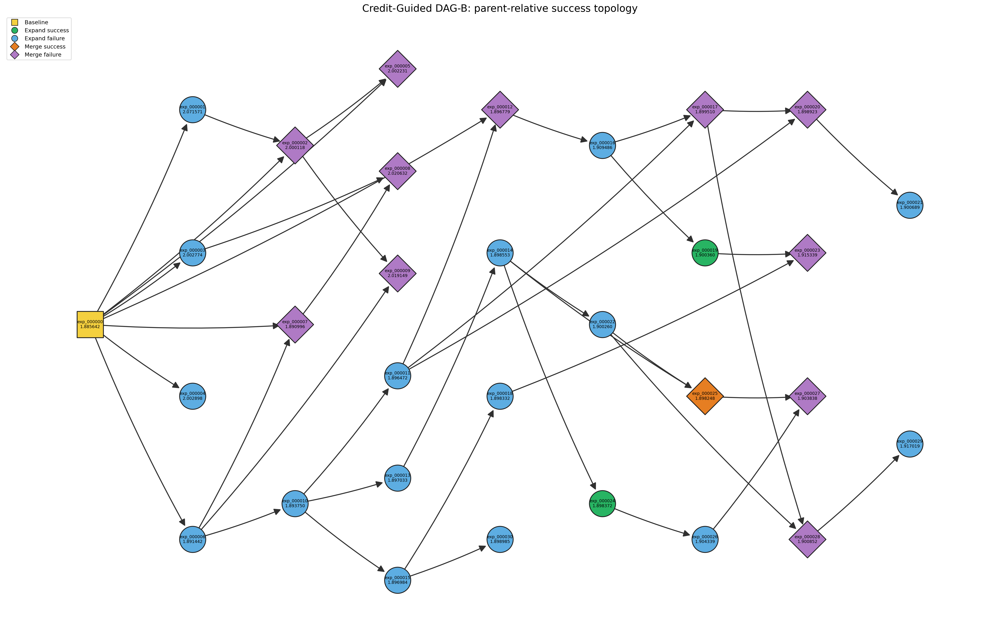

# Credit-Guided DAG-B Experiment Report

## 摘要

Credit-Guided DAG-B 在保留 DAG-A 的 node-level credit、softmax parent sampling 和 50/50 Expand/Merge operation draw 的前提下，只改变 Merge intent 内的失败处理：semantic reject 后排除该 exact pair，并从同一次 operation 开始时冻结的分布中重采样，最多尝试 3 个不同 pair；若仍未成功或 pair pool 耗尽，则 fallback 到 Expand。

独立审计 `dag.json`、operation metadata 和 candidate results 后，DAG-B 共得到 30 个 valid finished candidates，其中 18 个 Expand、12 个 Merge。19 次 Merge intent 内记录了 24 次 semantic reject 和 6 次 fallback Expand；另有 1 次 intent 因 quota circuit breaker 安全停止。最终 `T=42`，与 `18×1+12×2` 一致。DAG-B 将 finished Merge 占比从 DAG-A 的 4/30 提高到 12/30，也将 Merge intent 到 finished Merge 的转换率从 4/36 提高到 12/19，说明 retry/fallback 明显缓解了执行层面的结构瓶颈。

但结构改善没有转化为超过 baseline 的优化结果。Baseline 为 **1.885642**；最佳 candidate 是 `exp_000007`，为 **1.890996**，30 个 candidates 中没有一个优于 baseline。12 个 Merge 中仅 `exp_000025` 优于自己的两个 parents，成功率为 1/12（8.3%），且改善仅 0.000305 val_bpb。当前主要瓶颈已不再只是 Merge 数量不足，而更接近候选机制缺乏多样性、pair compatibility 与 Merge synthesis quality。

---

## 1. Motivation

DAG-A 使用 node-level Credit-Guided sampling：根据单个节点的质量、历史 child improvement 和 exploration bonus 分配 parent selection 概率。然而，Merge 是否可执行取决于两个 parents 的修改是否独立且可组合。DAG-A 中 operation draw 本身接近 50/50，但 36 次 Merge attempts 有 31 次 semantic reject，最终仅得到 4 个 finished Merge；大量 pair 是相同参数的替代值、相同 effective setting、祖先—后代 refinement，或 baseline 与单一修改的组合。

这暴露出 node-level credit 与 pair-level compatibility 的错配：两个节点各自有较高 credit，并不意味着它们构成可合并的 pair。DAG-B 要回答的是：如果保留 DAG-A 的 node-level Credit-Guided selection，但允许一次 Merge intent 在首个 incompatible pair 后重采样，是否能够：

1. 提高真正执行的 Merge 数量；
2. 避免一次 Merge exploration intent 被单个 incompatible pair 直接浪费；
3. 最终改善优化结果。

## 2. DAG-B Method

### 2.1 Credit-Guided node selection

所有 `status=finished`、具有有限 `val_bpb` 的节点均为 eligible nodes。令节点 \(v\) 的 validation loss 为 \(L_v\)，当前 eligible nodes 中最低 loss 为 \(L_{best}\)，实现中的 `quality_scale=0.01`。

质量项为：

\[
Q(v)=\frac{L_{best}-L_v}{0.01}.
\]

因为 val_bpb 越低越好，当前最优节点的 \(Q=0\)，其他节点为负值。

对每个以 \(v\) 为直接 parent 的 finished valid child \(c\)，定义：

\[
\operatorname{improvement}(v,c)=\frac{L_v-L_c}{0.01}.
\]

历史 offspring contribution 是这些 improvement 的均值：

\[
E(v)=\operatorname{mean}_{c}\left(\frac{L_v-L_c}{0.01}\right),
\]

若没有 finished valid child，则 \(E(v)=0\)。Merge child 会相对于两个 parents 分别贡献一次 observation。

令 \(n_v\) 为节点已被实际提交为 parent 的次数，\(T\) 为所有已提交 parent selections 的总数。Exploration term 为：

\[
H(v)=\sqrt{\frac{\log(T+1)}{n_v+1}}.
\]

总 credit 使用实际配置 `lambda_credit=0.5`、`gamma_explore=0.5`：

\[
C(v)=Q(v)+0.5E(v)+0.5H(v).
\]

Parent probability 使用 temperature 为 1.0 的稳定 softmax：

\[
P(v)=\frac{\exp((C(v)-\max_u C(u))/1.0)}
{\sum_j\exp((C(j)-\max_u C(u))/1.0)}.
\]

Expand 直接按 \(P(v)\) 抽取一个 parent。Merge 的基础 pair 权重沿用 DAG-A：先按 base softmax 选第一个 parent，再移除它、重新归一化后选第二个 parent。对有序 pair \((a,b)\)，基础权重为 \(P(a)P(b\mid a\text{ removed})\)；两个顺序都参与未尝试 unordered pair 的条件化抽样，两个 parents 必须不同。

### 2.2 Operation selection

每次 operation 开始时，以 50/50 随机抽取 `operation_draw=expand` 或 `operation_draw=merge`。这是探索意图，不等于最终执行的 operation：Merge intent 可能成功形成 Merge，也可能在 retry pool 耗尽后 fallback 为 Expand，或因明确的 quota stop 不形成 candidate。

### 2.3 Merge retry mechanism

一次 Merge intent 开始时冻结 eligible nodes、credit records 和 softmax distribution。随后：

1. 从尚未在本 intent 中尝试的 eligible pairs 中，按 DAG-A 的 credit-weighted pair distribution 抽取一个 pair；
2. 进行 semantic compatibility/fusion check；
3. 若成功形成可执行 proposal，立即停止重试并执行 Merge；
4. 若 semantic reject，则保存 exact pair 和 reason，并从本 intent 的 pair pool 中排除该 unordered pair；
5. 继续按冻结分布在剩余 pairs 上条件化重采样；
6. 最多尝试 `K=3` 个不同 pairs；若 3 次均 reject，或 pool 在此之前耗尽，则 fallback 到 Expand。

因此，retry 改变的是一次 Merge intent 内的 allocation，不改变 operation draw、credit 公式或基础 pair weighting。

### 2.4 Fallback Expand

Fallback Expand 完全沿用 DAG-A 的 Credit-Guided Expand sampling，并使用本次 operation 开始时冻结的同一 eligible-node snapshot 和 softmax probabilities。Semantic-rejected Merge parents 不会影响这一分布，也不会获得 parent-use credit。

### 2.5 Accounting

计数采用 committed-operation semantics：

- Semantic-rejected pair：不增加 \(T\)，不增加任一 rejected parent 的 `parent_uses`；
- Preparation/infrastructure failure：不提交 counters；
- Successful Expand：\(T\mathrel{+}=1\)，实际 parent 的 `parent_uses += 1`；
- Successful Merge：\(T\mathrel{+}=2\)，两个实际 parents 各 `parent_uses += 1`；
- Fallback Expand：按实际执行的 Expand 计数，即 \(T\mathrel{+}=1\)，只增加 fallback parent 的 usage。

因此 \(T\) 是已提交的 parent selections 数，不是 candidate 数。本轮 `T=18+2×12=42`。

### 2.6 Controlled experimental setup

| 项目 | 实际设置 |
|---|---|
| Baseline | `exp_000000`, val_bpb = 1.885642 |
| Hardware | Local NVIDIA RTX 5070 Laptop GPU |
| GPU / workers | Single GPU, `workers=1` |
| Candidate agent | 显式 `codex exec --model gpt-5.6-luna`，无 default/fallback model |
| Seed | `AUTORESEARCH_SEED=42` |
| Training budget | `TRAIN_TIME_BUDGET=300.0` seconds |
| Termination | `total_training_time < TRAIN_TIME_BUDGET` |
| Progress | `min(total_training_time / TRAIN_TIME_BUDGET, 1.0)` |
| Evaluation | `evaluate_bpb(model, tokenizer, DEVICE_BATCH_SIZE)` |
| Validation | 相同 controlled-invariant validator；只允许受控 research change |
| Execution | 串行，一次一个 candidate |
| Formal target | 30 个 valid finished candidates，不含 baseline |

有效 candidate 必须完成 preparation、controlled-invariant validation、training 和 evaluation，具有 finite `val_bpb` 且状态为 `finished`。Semantic reject、preparation/infrastructure failure、quota stop、中断或无效 metric 均不计入 30。

## 3. Results

### 3.1 独立核验

| 核验项 | 文件中结果 | 与给定 summary |
|---|---:|---|
| Valid finished candidates | 30 | 一致 |
| Finished Expand / Merge | 18 / 12 | 一致 |
| Merge intents | 19 | 一致 |
| Semantic rejected pair attempts | 24 | 一致 |
| Fallback Expands | 6 | 一致 |
| Baseline val_bpb | 1.885642 | 一致 |
| Best candidate | `exp_000007`, 1.890996 | 一致 |
| Better than baseline | 0 | 一致 |
| Final T | 42 | 一致 |
| DAG nodes / edges | 31 / 42 | 拓扑一致 |

31 个 nodes 包含 baseline 和 30 个 candidates。Baseline indegree 为 0；18 个 Expand 的 indegree 均为 1；12 个 Merge 的 indegree 均为 2。全部 42 条 parent-child edges 的 parent ID 均存在，方向均为 parent → child。

Operation metadata 实际有 31 条记录：30 条形成 valid candidate，另 1 条 `op_000023` 是被 quota circuit breaker 截止且已 rollback 的 Merge intent。它没有 semantic reject、没有 final operation、没有 candidate node，也没有改变 counters。因而 19 个 Merge intents 的去向是 12 Merge、6 fallback Expand、1 quota stop。

### 3.2 Operation flow

- Merge intent → finished Merge conversion：12/19 = **63.2%**；若只看未被外部 quota 中断的 18 个 intents，则为 66.7%。
- Merge intent fallback rate：6/19 = **31.6%**。
- Direct Expand intents：12；finished Expand：18，其中 6 个来自 Merge fallback。
- Semantic rejects per Merge intent：mean **1.263**，median **1**。
- Reject-count distribution：0 rejects = **8** intents，1 = **3**，2 = **3**，3 = **5**。

这里的 0-reject 桶包含 7 个首 pair 即成功的 Merge intent和 1 个在 pair proposal 阶段被 quota stop 的 intent。

### 3.3 Expand 与 Merge 的 val_bpb

| Operation | N | Mean | Median | Best | Worst | Population SD |
|---|---:|---:|---:|---:|---:|---:|
| Expand | 18 | 1.921073 | 1.899623 | 1.891442 | 2.071571 | 0.048958 |
| Merge | 12 | 1.937218 | 1.902345 | 1.890996 | 2.020632 | 0.052399 |

两组都没有超过 baseline。Merge 的最佳值略优于 Expand 的最佳值，但 Merge 的均值、中位数和标准差均不显示整体优化优势。

### 3.4 Merge child 是否优于自己的 parents

核心定义为：

\[
\text{merge_success}=L_{child}<\min(L_{parent1},L_{parent2}).
\]

`delta best` 为 child val_bpb 减去较好 parent 的 val_bpb；负值才是成功。

| Merge child | Parent 1 | P1 val | Parent 2 | P2 val | Child val | Δ best | Δ worst | Beat best / both |
|---|---|---:|---|---:|---:|---:|---:|---|
| exp_000002 | exp_000000 | 1.885642 | exp_000001 | 2.071571 | 2.000118 | +0.114476 | -0.071453 | No |
| exp_000005 | exp_000000 | 1.885642 | exp_000002 | 2.000118 | 2.002231 | +0.116589 | +0.002113 | No |
| exp_000007 | exp_000006 | 1.891442 | exp_000000 | 1.885642 | 1.890996 | +0.005354 | -0.000446 | No |
| exp_000008 | exp_000003 | 2.002774 | exp_000007 | 1.890996 | 2.020632 | +0.129636 | +0.017858 | No |
| exp_000009 | exp_000006 | 1.891442 | exp_000002 | 2.000118 | 2.019149 | +0.127707 | +0.019031 | No |
| exp_000012 | exp_000011 | 1.896472 | exp_000000 | 1.885642 | 1.896779 | +0.011137 | +0.000307 | No |
| exp_000017 | exp_000011 | 1.896472 | exp_000016 | 1.909486 | 1.899510 | +0.003038 | -0.009976 | No |
| exp_000020 | exp_000011 | 1.896472 | exp_000017 | 1.899510 | 1.898923 | +0.002451 | -0.000587 | No |
| exp_000023 | exp_000018 | 1.898332 | exp_000019 | 1.900360 | 1.915339 | +0.017007 | +0.014979 | No |
| **exp_000025** | exp_000014 | 1.898553 | exp_000022 | 1.900260 | **1.898248** | **-0.000305** | **-0.002012** | **Yes** |
| exp_000027 | exp_000026 | 1.904339 | exp_000025 | 1.898248 | 1.903838 | +0.005590 | -0.000501 | No |
| exp_000028 | exp_000017 | 1.899510 | exp_000022 | 1.900260 | 1.900852 | +0.001342 | +0.000592 | No |

结果是 **1/12 merge_success，成功率 8.3%**。Successful Merge IDs：`exp_000025`。其余 11 个 Merge 均未超过 best parent。即使结构上执行了更多 Merge，绝大多数 synthesis 也没有产生超过较好输入分支的 child。

### 3.5 Parent usage concentration

| Actual parent usage | Nodes |
|---:|---|
| 8 | `exp_000000` |
| 3 | `exp_000006`, `exp_000010`, `exp_000011`, `exp_000014` |
| 2 | `exp_000002`, `exp_000015`, `exp_000016`, `exp_000017`, `exp_000022` |
| 1 | `exp_000001`, `exp_000003`, `exp_000007`, `exp_000012`, `exp_000013`, `exp_000018`, `exp_000019`, `exp_000020`, `exp_000024`, `exp_000025`, `exp_000026`, `exp_000028` |
| 0 | 其余 9 个 candidate nodes |

Baseline 占 8/42 = **19.0%** 的实际 parent selections；前 5 个最常用节点合计占 20/42 = **47.6%**。这说明存在明显但非完全垄断的 usage concentration。Quality/credit 与 usage 图显示，较好节点通常拥有更高被选概率，但 stochastic sampling、exploration bonus、节点加入时间和 descendant contribution 共同作用，使最终 usage 不能只由静态 val_bpb 解释。

更重要的是，lineage 的机制多样性很低：reject reasons 和 candidate hypotheses 反复围绕 `WARMDOWN_RATIO` 的不同取值。因而即使使用分布覆盖了多个 node ID，语义上仍可能集中在同一类 schedule refinement 上。

### 3.6 Semantic reject taxonomy

| Category | Count | Percentage | Representative examples |
|---|---:|---:|---|
| Ancestor/descendant same-parameter refinement | 9 | 37.5% | `exp_000006+exp_000010`, `exp_000010+exp_000011`, `exp_000010+exp_000024` |
| Exact same effective setting | 7 | 29.2% | `exp_000006+exp_000007` 均为 70% warmdown；`exp_000014+exp_000017` 为相同 90→95 change |
| Parallel same-parameter alternatives | 6 | 25.0% | `exp_000007+exp_000010`, `exp_000012+exp_000014`, `exp_000017+exp_000019` |
| Baseline + single modification | 2 | 8.3% | `exp_000000+exp_000007`, `exp_000000+exp_000010` |
| **Total** | **24** | **100%** | — |

这些分类来自保存的逐 pair reject reason，并结合 DAG ancestor 关系判定。24/24 都仍属于 same-setting、same-parameter alternative、ancestor/refinement 或 baseline+single-change；没有观察到新的跨机制 rejection pattern。与 DAG-A 相同，最核心的 compatibility 问题不是复杂机制之间发生意外冲突，而是可选节点在语义上高度同质。

### 3.7 DAG-A 与 DAG-B 直接比较

| Metric | DAG-A | DAG-B |
|---|---:|---:|
| Valid candidates | 30 | 30 |
| Finished Expand / Merge | 26 / 4 | 18 / 12 |
| Merge intents / attempts | 36（每 intent 单 pair） | 19 intents |
| Semantic rejects | 31 | 24 pair attempts |
| Fallback Expand | N/A | 6 |
| Merge intent → finished Merge | 4/36 = 11.1% | 12/19 = 63.2% |
| Finished Merge share | 4/30 = 13.3% | 12/30 = 40.0% |
| Best val_bpb | 1.895905 (`exp_000004`) | 1.890996 (`exp_000007`) |
| Better than baseline | 0 | 0 |
| Final T | 34 | 42 |
| Merge beating best parent | 0/4 | 1/12 |

DAG-A 的 “Merge attempts” 与 intents 等价，因为首次 semantic reject 就结束该 operation；DAG-B 则必须区分 intent 与 intent 内的 pair attempts。DAG-B 的 19 intents 中实际发生了 36 次已得到 semantic outcome 的 pair checks（24 rejects + 12 accepted），另有 1 次 proposal 因 quota stop 中止。

**Structural / execution improvement：** DAG-B 明显解决了“一个 incompatible pair 直接浪费整个 Merge intent”的问题。Merge conversion 从 11.1% 提升到 63.2%，finished Merge 从 4 增加到 12，拓扑由 13.3% Merge 提升到 40.0% Merge。它没有强制最终 50/50，但 operation intent 与最终有效执行之间的脱节显著缩小。

**Optimization / val_bpb improvement：** DAG-B 的 best val_bpb 比 DAG-A 的 best 更低，但两个独立随机轨迹都没有超过同一 baseline，不能把跨运行的 best 差异直接解释为算法性 gain。DAG-B 的 12 个 Merge 仅 1 个超过 best parent，而且幅度很小。因此，结构改善没有在本次 30-run 中转化为有说服力的 optimization improvement。

## Parent-Relative Improvement Analysis

“没有 candidate beat baseline”只描述 absolute performance，不能推出没有局部改善。本节分别衡量：

- **Baseline-relative**：child 是否低于固定 baseline 1.885642；
- **Expand parent-relative**：child 是否低于其唯一 parent；
- **Merge parent-relative**：child 是否低于两个 parents 中较好的一个。

### 全部 18 个 Expand

`delta_parent = child − parent`，`delta_baseline = child − baseline`；负值表示改善。

| Child | Parent | Parent val_bpb | Child val_bpb | Δ parent | Δ baseline | Beat parent |
|---|---|---:|---:|---:|---:|---|
| exp_000001 | exp_000000 | 1.885642 | 2.071571 | +0.185929 | +0.185929 | No |
| exp_000003 | exp_000000 | 1.885642 | 2.002774 | +0.117132 | +0.117132 | No |
| exp_000004 | exp_000000 | 1.885642 | 2.002898 | +0.117256 | +0.117256 | No |
| exp_000006 | exp_000000 | 1.885642 | 1.891442 | +0.005800 | +0.005800 | No |
| exp_000010 | exp_000006 | 1.891442 | 1.893750 | +0.002308 | +0.008108 | No |
| exp_000011 | exp_000010 | 1.893750 | 1.896472 | +0.002722 | +0.010830 | No |
| exp_000013 | exp_000010 | 1.893750 | 1.897033 | +0.003283 | +0.011391 | No |
| exp_000014 | exp_000013 | 1.897033 | 1.898553 | +0.001520 | +0.012911 | No |
| exp_000015 | exp_000010 | 1.893750 | 1.896984 | +0.003234 | +0.011342 | No |
| exp_000016 | exp_000012 | 1.896779 | 1.909486 | +0.012707 | +0.023844 | No |
| exp_000018 | exp_000015 | 1.896984 | 1.898332 | +0.001348 | +0.012690 | No |
| **exp_000019** | exp_000016 | 1.909486 | **1.900360** | **-0.009126** | +0.014718 | **Yes** |
| exp_000021 | exp_000020 | 1.898923 | 1.900689 | +0.001766 | +0.015047 | No |
| exp_000022 | exp_000014 | 1.898553 | 1.900260 | +0.001707 | +0.014618 | No |
| **exp_000024** | exp_000014 | 1.898553 | **1.898372** | **-0.000181** | +0.012730 | **Yes** |
| exp_000026 | exp_000024 | 1.898372 | 1.904339 | +0.005967 | +0.018697 | No |
| exp_000029 | exp_000028 | 1.900852 | 1.917019 | +0.016167 | +0.031377 | No |
| exp_000030 | exp_000015 | 1.896984 | 1.898985 | +0.002001 | +0.013343 | No |

Expand 统计如下：

- Total：18；beat parent：**2**；worse：16；equal：0；
- Parent-relative success rate：**2/18 = 11.1%**；
- Mean / median delta_parent：**+0.026197 / +0.002978**；
- Best / worst delta_parent：**-0.009126 / +0.185929**；
- Beat baseline：0；worse than baseline：18。

### Local recovery but still below baseline quality

存在两个 `child < parent` 但 `child >= baseline` 的案例：

| Parent → child | Parent val | Child val | Improvement amount | Distance from baseline |
|---|---:|---:|---:|---:|
| exp_000016 → exp_000019 | 1.909486 | 1.900360 | 0.009126 | +0.014718 |
| exp_000014 → exp_000024 | 1.898553 | 1.898372 | 0.000181 | +0.012730 |

因此 DAG-B 确实存在 local recovery，但只有 2/18 次，其中一次幅度非常小。它不是“经常局部改善但恢复不足”的主导模式；更显著的现象是绝大多数 Expand 本身也没有超过 parent。

### Expand 与 Merge 的局部成功比较

Merge 指标已从正式 state 重新计算，仍为 child 相对于 `min(parent1,parent2)`。

| Metric | Expand | Merge |
|---|---:|---:|
| Total | 18 | 12 |
| Local successes | 2 | 1 |
| Success rate | 11.1% | 8.3% |
| Mean delta vs best parent | +0.026197 | +0.044502 |
| Median delta vs best parent | +0.002978 | +0.008363 |
| Best delta | -0.009126 | -0.000305 |
| Worst delta | +0.185929 | +0.129636 |

Merge 的 success rate、mean 和 median 都比 Expand 差，但差异不是“Expand 正常而 Merge 单独失效”：Expand 自身也只有 11.1% beat-parent。数据因此最接近诊断 **B**。问题比 Merge compatibility/synthesis 更广，至少还涉及 candidate proposal quality、已退化 lineage 上的继承式搜索，以及 credit-guided allocation 对高度同质 proposal space 的处理。由于样本数较小，不能仅凭 11.1% 与 8.3% 的差异断言 Merge 有独立的额外故障。

### Expand correctness audit

对全部 18 个 Expand 做了 Git lineage 审计，而不只是抽样：

- 18/18 child commits 的直接 Git parent 均等于 `dag.json` 中记录 parent 的 commit；
- 18/18 parent→child diffs 都只涉及 `train.py`；
- 每个 diff 都是 1 行新增、1 行删除，没有异常大范围修改；
- 代表性的 hypotheses 与代码修改均描述在 parent 基础上的 schedule/warmdown refinement；
- candidate metadata 均为 committed parent selection，result logs 与 state 中的 val_bpb、step accounting 一致；
- 未发现恢复 baseline、错误 branch/worktree、controlled files 变化或 parent metadata 与代码 lineage 不一致。

训练步数会因固定 300 秒 time budget 下的实际吞吐而在 20–24 间变化，这是既定 time-based protocol 的正常结果，不是 lineage 错误。只读审计没有发现能解释低 Expand success rate 的基础设施或继承异常。

### DAG-A 对照

DAG-A 数据仍可用，并以相同定义重新计算：

| Metric | DAG-A | DAG-B |
|---|---:|---:|
| Expand count | 26 | 18 |
| Expand beat-parent count | 3 | 2 |
| Expand success rate | 11.5% | 11.1% |
| Mean delta_parent | +0.009889 | +0.026197 |
| Median delta_parent | +0.004730 | +0.002978 |
| Expand beat-baseline count | 0 | 0 |

两个独立运行的 Expand parent-relative success rate 几乎相同，而且都只有约 11%。这使“一致的 parent-relative degradation pattern”比单次偶然更可信。DAG-B 的较大 mean 受早期三个极差 baseline children 强烈影响；median 仍为正，说明结论不只由 outlier 驱动。

诊断图：

- `expand_child_vs_parent.png` (artifact intentionally omitted from the curated archive)
- `local_improvement_comparison.png` (artifact intentionally omitted from the curated archive)

## Proposal-Level Failure Analysis

### Expand Parent-Relative Performance

DAG-B 的 absolute、local 和 Merge-specific 结果必须分开：30 个 candidates 中 0 个 beat baseline；18 个 Expand 中 2 个 beat own parent（11.1%）；12 个 Merge 中 1 个 beat best parent（8.3%）。两个 successful Expand `exp_000019`、`exp_000024` 都仍比 baseline 差。DAG-A 的 Expand 指标是 3/26（11.5%），说明低 parent-relative success 并非 DAG-B Merge policy 独有。

下表修改均来自 child commit 相对记录 parent commit 的真实 `train.py` diff。完整 proposal rationale 和 unified diff 见 `expand_modification_analysis.tsv` (artifact intentionally omitted from the curated archive)。

| Candidate | Parent | Parent val | Child val | Δ parent | Beat | Actual modification | Novelty |
|---|---|---:|---:|---:|---|---|---|
| exp_000001 | exp_000000 | 1.885642 | 2.071571 | +0.185929 | No | `WARMUP_RATIO` 0→0.02 | New family |
| exp_000003 | exp_000000 | 1.885642 | 2.002774 | +0.117132 | No | `WARMUP_RATIO` 0→0.05 | New value |
| exp_000004 | exp_000000 | 1.885642 | 2.002898 | +0.117256 | No | `WARMUP_RATIO` 0→0.10 | New value |
| exp_000006 | exp_000000 | 1.885642 | 1.891442 | +0.005800 | No | `WARMDOWN_RATIO` 0.50→0.70 | New family |
| exp_000010 | exp_000006 | 1.891442 | 1.893750 | +0.002308 | No | `WARMDOWN_RATIO` 0.70→0.80 | Refinement |
| exp_000011 | exp_000010 | 1.893750 | 1.896472 | +0.002722 | No | `WARMDOWN_RATIO` 0.80→0.90 | Refinement |
| exp_000013 | exp_000010 | 1.893750 | 1.897033 | +0.003283 | No | `WARMDOWN_RATIO` 0.80→0.90 | Near-duplicate |
| exp_000014 | exp_000013 | 1.897033 | 1.898553 | +0.001520 | No | `WARMDOWN_RATIO` 0.90→0.95 | Refinement |
| exp_000015 | exp_000010 | 1.893750 | 1.896984 | +0.003234 | No | `WARMDOWN_RATIO` 0.80→0.90 | Near-duplicate |
| exp_000016 | exp_000012 | 1.896779 | 1.909486 | +0.012707 | No | `WARMDOWN_RATIO` 0.90→0.95 | Near-duplicate |
| exp_000018 | exp_000015 | 1.896984 | 1.898332 | +0.001348 | No | `WARMDOWN_RATIO` 0.90→0.95 | Near-duplicate |
| **exp_000019** | exp_000016 | 1.909486 | **1.900360** | **-0.009126** | **Yes** | `WARMDOWN_RATIO` 0.95→1.00 | Refinement |
| exp_000021 | exp_000020 | 1.898923 | 1.900689 | +0.001766 | No | `WARMDOWN_RATIO` 0.95→1.00 | Near-duplicate |
| exp_000022 | exp_000014 | 1.898553 | 1.900260 | +0.001707 | No | `WARMDOWN_RATIO` 0.95→1.00 | Near-duplicate |
| **exp_000024** | exp_000014 | 1.898553 | **1.898372** | **-0.000181** | **Yes** | `WARMDOWN_RATIO` 0.95→1.00 | Near-duplicate |
| exp_000026 | exp_000024 | 1.898372 | 1.904339 | +0.005967 | No | `MATRIX_LR` 0.040→0.036 | New family |
| exp_000029 | exp_000028 | 1.900852 | 1.917019 | +0.016167 | No | LR decay linear→quadratic | New mechanism |
| exp_000030 | exp_000015 | 1.896984 | 1.898985 | +0.002001 | No | `WARMDOWN_RATIO` 0.90→0.95 | Near-duplicate |

### Modification Family Analysis

| Family | Count | Beat parent | Success rate | Mean Δ | Best Δ | Worst Δ |
|---|---:|---:|---:|---:|---:|---:|
| `WARMDOWN_RATIO` | 13 | 2 | 15.4% | +0.002238 | -0.009126 | +0.012707 |
| `WARMUP_RATIO` | 3 | 0 | 0% | +0.140106 | +0.117132 | +0.185929 |
| `MATRIX_LR` | 1 | 0 | 0% | +0.005967 | +0.005967 | +0.005967 |
| LR decay shape | 1 | 0 | 0% | +0.016167 | +0.016167 | +0.016167 |

18 个 Expand 只覆盖 **4 个** modification families。最大 family `WARMDOWN_RATIO` 占 **13/18 = 72.2%**。Warmup 的三个数值都显著恶化；optimizer LR 和 decay shape 各只尝试一次，architecture、attention、regularization、batch setting 等没有出现在 finished Expand 中。

### Repetition and Diversity

除每个 family 首次出现外，**14/18** candidates 都是既有 family 的新数值、ancestor refinement 或 near-duplicate。严格按“相同参数、相同 old→new transition”判定，有 **8 个冗余 near-duplicates**：0.80→0.90 的 `exp_000013/15`，0.90→0.95 的 `exp_000016/18/30`，以及 0.95→1.00 的 `exp_000021/22/24`。连同各组首次出现者，共 11 个 candidates 落在三个 exact-transition duplicate groups。

`exp_000019` 与 `exp_000022` 的 final `train.py` blob 完全相同；`exp_000021` 与 `exp_000024` 也完全相同。相同有效修改被多次提出，却没有产生新的机制知识。结果会因 parent state、time-budget step count 和运行波动而不同。

这与 Merge 侧 24/24 semantic rejects 集中于 `WARMDOWN_RATIO` 完全一致：Expand 和 Merge 暴露出同一个更上游的 **insufficient mechanism diversity**。记录没有显示 proposal generator 获得了足够结构化的 negative feedback 来阻止失败 family/transition 重现；这是根据轨迹作出的机制假设，不是对 Luna 内部状态的直接观察。

### Successful Expand Case Studies

`exp_000019` 从 `exp_000016` 出发，将 `WARMDOWN_RATIO` 0.95→1.0。Parent 1.909486，child 1.900360，改善 **0.009126**，但仍比 baseline 差 0.014718。Agent 假设 full-run warmdown 减少 late-stage overshoot；结果与方向相容，但同 transition 的其他尝试多为负面，不能确认因果。其较差 parent 提供了较大的 local recovery 空间。

`exp_000024` 从 `exp_000014` 出发，也执行 0.95→1.0。Parent 1.898553，child 1.898372，仅改善 **0.000181**，仍比 baseline 差 0.012730。同一 parent 的 `exp_000022` 执行相同有效修改却恶化 0.001707，因此最稳妥的判断是弱且不稳定的局部信号，不能排除 time-based run variation。

两个 success 都不是新机制，而是最大 family 中同一数值 transition；成功 proposal 并未表现出更高 novelty。

### Lineage Behavior

Warmdown 主干为 baseline→`exp_000006` (0.7)→`exp_000010` (0.8)，随后平行生成多个 0.9、0.95、1.0 variants。`exp_000006/10/11/14` 各被实际使用 3 次，说明预算持续集中于该 family，但绝大多数 child 更差。

两个 local success 都获得过一次后续机会，却未被有效利用：`exp_000019` 参与 Merge 生成 `exp_000023=1.915339`，未超过 best parent；`exp_000024` 的 Expand child `exp_000026=1.904339` 也破坏了局部改善，随后 `exp_000026` 参与的 Merge 同样失败。Parent usage 只部分与 improvement history 对齐；node coverage 没有转化为 mechanism coverage。

### Parent Quality and Proposal Success

Parent val_bpb 与 delta_parent 的 descriptive Pearson correlation 为 **-0.671**，Spearman 为 **-0.621**。负号意味着本样本中较差 parent 更容易出现 local recovery，而非较好 parent 更容易继续改善。关系受三个极差 baseline→warmup outcome 和 `exp_000019` recovery 强烈影响，且 N=18，不能作因果解释。

四个以最优 baseline 为 parent 的 Expand 全部失败；两个 success 的 parents 分别为 1.909486 和 1.898553。数据不支持“best-parent region 更容易 improvement”，更像较差 parent 有较大回归空间，但恢复仍不足以达到 baseline。

*Figure intentionally omitted from the curated archive: Expand parent quality versus delta.*

### Bottleneck Diagnosis

整体最接近 **E：mixed bottleneck**，其中证据最强的是 **B（proposal quality）+ C（proposal diversity）**。16/18 Expand 直接使 parent 变差；13/18 集中于一个 family，14/18 是 repeated/refinement，8 个是严格 near-duplicates。存在次级 A 型 allocation 问题，因为少数 warmdown lineages 被反复使用；但 baseline parent 的 proposals 同样全部失败，不能主要归责 parent selection。D 不是主要解释：Merge 8.3% 虽低于 Expand 11.1%，但 Expand 本身远未正常。

结论应分层表达：结构上 Merge intent→finished Merge 从 **11.1% 提高到 63.2%**；优化上仍为 **0/30 beat baseline**；parent-relative 上 Expand 为 **11.1%**、Merge 为 **8.3%**；proposal-level 上则是低成功率和严重 mechanism-family collapse。DAG-B 解决了 Merge execution bottleneck，但没有解决更上游的 proposal generation bottleneck。

## 4. Figures

- `fig_dag_directed.png` (artifact intentionally omitted from the curated archive)（`fig_dag_directed.pdf` (artifact intentionally omitted from the curated archive)）
- `val_bpb_vs_candidate_index.png` (artifact intentionally omitted from the curated archive)
- [Global best-so-far](figures/global_best_so_far.png)
- `operation_attempts_vs_finished.png` (artifact intentionally omitted from the curated archive)
- `merge_reject_distribution.png` (artifact intentionally omitted from the curated archive)
- [Merge child versus best parent](figures/merge_child_vs_best_parent.png)
- `parent_usage_distribution.png` (artifact intentionally omitted from the curated archive)
- `parent_quality_vs_parent_usage.png` (artifact intentionally omitted from the curated archive)
- `credit_vs_parent_usage.png` (artifact intentionally omitted from the curated archive)
- `expand_parent_quality_vs_delta.png` (artifact intentionally omitted from the curated archive)
- [Parent-relative success DAG](figures/fig_dag_directed_success.png)

Directed DAG 使用显式 directed edges、`-|>` arrowheads、放大的 arrow size 和 parent → child 方向。生成脚本在保存前断言 31 nodes、42 edges、baseline indegree 0、每个 Expand indegree 1、每个 Merge indegree 2。

## 5. Discussion

### 5.1 DAG-B 是否提高了 Merge 真正执行的比例？

是。Finished Merge 从 DAG-A 的 4/30 增加到 12/30，Merge intent conversion 从 11.1% 增加到 63.2%。这不是 operation draw 比例被改变，而是单个 rejected pair 不再立即终止一次 Merge intent。

### 5.2 Retry-after-reject 是否解决了 structural bottleneck？

它显著缓解了直接的执行瓶颈，但没有消除 compatibility bottleneck。24 次 semantic rejects 仍发生在 19 个 intents 中，且 5 个 intents 用满 3 次 retry；6 个 intents 最终 fallback。DAG-B 更有效地穿过 incompatible pairs 找到可执行 pair，但 compatible pair pool 本身仍然稀疏且同质。

### 5.3 更多 finished Merge 是否带来更好的 val_bpb？

没有可靠证据。0/30 candidates 优于 baseline；Merge 的均值和中位数也没有优于 Expand。最佳 DAG-B candidate 恰为 Merge，但仍比 baseline 差 0.005354。

### 5.4 Finished Merge 是否经常优于自己的 parents？

否。只有 `exp_000025` 在 12 个 Merge 中优于两个 parents，成功率 8.3%。多数 Merge 至多优于较差 parent，却不能超过较好 parent；这表示 synthesis 通常没有产生增量价值。

### 5.5 Node-level credit 是否仍导致 lineage concentration？

存在一定 concentration：baseline 单独占 19.0% parent uses，top 5 占 47.6%。不过更严重的是 semantic concentration：许多不同 node ID 实际仍表示 `WARMDOWN_RATIO` 的相同或相邻取值。Node-level credit 能分配节点预算，但不能保证机制多样性或 pair complementarity。

### 5.6 当前主要 bottleneck

数据不再支持把 **insufficient Merge quantity** 视为首要问题：12/30 的 Merge 数量已足以检验其局部价值，而其中只有 1 次超过 best parent。主要瓶颈更像是：

1. **Merge synthesis quality**：compatible 并不等于能产生超过 best parent 的有效组合；
2. **机制多样性与 pair compatibility**：候选集中在同一 warmdown scalar，导致大量同参数 alternatives/refinements；
3. **Node-level parent selection 的表达能力**：credit 衡量节点价值，却没有显式奖励 pair complementarity。

Parent usage concentration 是次要信号，但本轮更直接的证据指向 proposal/search-space collapse 与 pair-level synthesis，而不是单纯的 exploration 次数不足。

## 6. Implications for the Next Experiment

以下是可独立检验的候选 hypothesis；本报告不选择或实现其中任何方案：

1. **Proposal-level best-of-K generation + ranking。** 针对 16/18 Expand 使 parent 变差：固定 parent selection 与训练配置，每次生成 K 个修改，再用预定义 feasibility/novelty/evidence rubric 只执行一个。若 beat-parent rate 显著高于约 11% 且 family coverage 不下降，则支持单-proposal quality hypothesis；若仍相近则反驳。
2. **结构化 negative-feedback memory + mechanism-diversity constraint。** 针对 13/18 warmdown concentration、8 个 near-duplicates 和 24 个同-family rejects：向 proposal context 提供已尝试 parameter transition、outcome 和禁重复 signature，并要求跨 family exploration。若 distinct families 增加、重复/reject 率下降且 parent-relative success 上升，则支持 diversity hypothesis；若只增加多样性而 success 不变，则重复不是主要优化瓶颈。
3. **Pair-level compatibility / improved Merge synthesis。** 在 proposal diversity 受控后，用 change signatures 选择互补 pairs，并检查两项修改是否都被 child 保留。若 Merge beat-best-parent rate从 8.3% 上升，则支持 pair/synthesis hypothesis；若兼容且 component-preserving 的 Merge 仍不改善，则机制本身或训练信号更可能受限。

## 7. Reproducible analysis artifacts

本报告的统计与图片由 `analysis/dag_b/analyze_and_plot.py`、`analyze_parent_relative.py` 和 `analyze_proposals.py` 从正式 `dag.json` 与 candidate Git commits 只读生成。机器可读摘要见 `summary.json`，完整 Expand diff/proposal 表见 `expand_modification_analysis.tsv`，family 统计见 `expand_family_summary.tsv`，12 个 Merge 明细见 `merge_details.tsv`，24 次 reject 的原始 reason 和分类见 `semantic_rejects.tsv`。分析过程没有启动 candidate、训练或修改正式实验状态。
