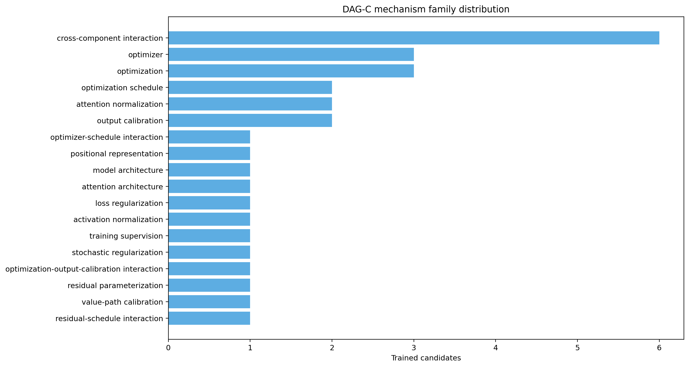
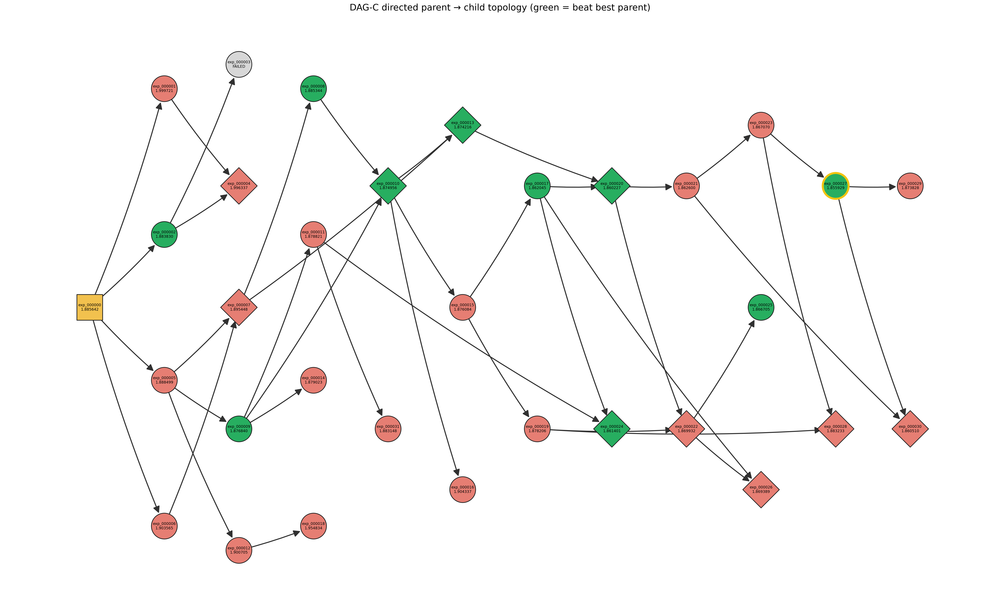
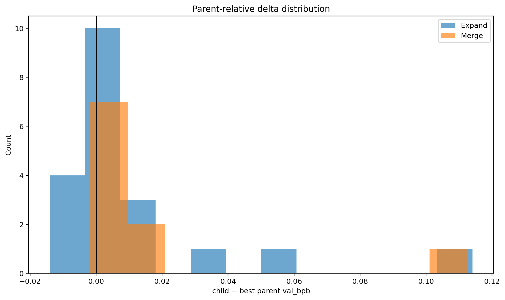

# DAG-C-v2: Proposal-Memory Credit-Guided DAG — Full Experiment Report

> **Curatorial note:** This is the original experiment-local report and is retained as historical interpretation. Its DAG-B/DAG-C cross-run comparisons are descriptive, not causal. The original comparison figure is intentionally omitted from this repository. A later baseline-provenance audit and calibration showed material optimizer-step/token-exposure variation under the wall-clock protocol; see the top-level README and `diagnostics/baseline_calibration/`.

## 1. Executive Summary

DAG-C was proposed after two earlier iterations separated a structural search problem from a proposal-quality problem. The Naive DAG preserved multiple candidate lineages but did not allocate search budget according to observed quality. DAG-A added node-level credit-guided parent selection, yet most Merge attempts were rejected because selected branches were semantically redundant. DAG-B added bounded Merge-pair retry and fallback, raising finished Merge nodes from 4/30 in DAG-A to 12/30. That fixed much of the Merge-starvation problem, but did not fix optimization: DAG-B produced 0/30 candidates below the 1.885642 baseline, its best candidate was 1.890996, and its proposals collapsed mainly onto variants of `WARMDOWN_RATIO`.

DAG-C therefore targeted proposal generation rather than parent allocation. It retained DAG-B's credit formula, stochastic parent selection, 50/50 operation draw, Merge-pair retry, accounting, model, seed, training budget, and evaluation. Its behavioral intervention was online proposal memory plus prompt-level diversity guidance, structured proposal metadata, a conservative pre-training novelty classifier, and up to three proposal/preparation retries. The intended mechanism was not “more randomness”; it was to expose the candidate generator to what had already been tried and whether those proposal families had beaten their parents, thereby discouraging proposal collapse and encouraging mechanistically distinct changes.

The completed run contains exactly 30 valid trained/evaluated candidates. Twenty-two beat the baseline; the best, `exp_000027`, reaches 1.855929. Expand beat-parent success is 6/20 (30.0%) and Merge beat-best-parent success is 4/10 (40.0%), versus 2/18 (11.1%) and 1/12 (8.3%) in DAG-B. A code-diff-based audit finds 18 canonical mechanism families in DAG-C versus 4 in DAG-B; the largest-family share falls from 66.7% to 13.3%, and exact-duplicate/refinement prevalence falls from 86.7% to 40.0%.

The most important new finding is that 22/30 is not 22 independent optimization discoveries. The 22 baseline wins decompose into 3 independent baseline crossings, 12 inherited successes that did not improve their best parent, 6 local improvements using an existing/refined mechanism, and 1 new-mechanism local improvement. Seventeen of the 22 wins lie in the combined `exp_000005 + exp_000006` ancestry, and 23/31 subsequent parent selections after `exp_000008` entered that combined lineage. The most plausible descriptive account is therefore exploration plus exploitation: proposal memory/diversity accompanied the discovery of productive mechanisms, while credit-guided selection concentrated later search in a productive region; inheritance preserved gains and several descendants improved them further.

These are observational findings from separate, single-seed adaptive trajectories. They do not establish that memory caused diversity, that diversity caused lower val_bpb, or that credit caused the successful lineage. The hard novelty gate rejected zero proposals, so the outcome cannot be attributed to hard rejection. Controlled ablations and repeated seeds are required for causal conclusions.

## 2. Background: From the Naive DAG to DAG-C

### 2.1 Naive DAG and DAG-A

The Naive DAG retained all valid historical candidates as possible parents, allowing both one-parent Expand and two-parent Merge. Its weakness was budget allocation: a poor or exhausted lineage could continue receiving search effort much like a productive lineage.

DAG-A introduced credit-guided selection. For each finished finite-metric node, the sampler combined current quality, the mean improvement of its children, and an exploration bonus. This changed parent allocation but exposed a mismatch between node quality and pair compatibility. DAG-A completed 26 Expands and only 4 Merges: 31 of 36 Merge attempts were semantically rejected. No candidate beat the common 1.885642 baseline; the best was 1.895905.

### 2.2 DAG-B: fixing Merge starvation

DAG-B kept DAG-A's node credit and 50/50 operation draw, but changed the handling of a Merge intent. A rejected pair was removed from a frozen within-operation pair pool; up to three distinct credit-weighted pairs could be tried, after which the operation fell back to a credit-guided Expand. This raised the finished Merge count from 4/30 to 12/30 and the Merge-intent-to-finished-Merge conversion from 4/36 (11.1%) to 12/19 (63.2%). DAG-B therefore substantially reduced execution-level Merge starvation.

The optimization result nevertheless remained weak:

| DAG-B metric | Observed result |
|---|---:|
| Baseline | 1.885642 |
| Best candidate | `exp_000007`, 1.890996 |
| Beat baseline | 0/30 |
| Expand beat parent | 2/18 (11.1%) |
| Merge beat best parent | 1/12 (8.3%) |
| Canonical mechanism families, later uniform audit | 4 |
| Largest family | linear warmdown duration, 20/30 (66.7%) |
| Exact duplicate or refinement | 26/30 (86.7%) |

The original Expand-only analysis similarly found only four modification families, with 13/18 Expand proposals concentrated on `WARMDOWN_RATIO` and 14/18 classified as repeats/refinements. Thus DAG-B solved much of the structural starvation while exposing proposal collapse as the next bottleneck.

### 2.3 Why DAG-C

DAG-C asks whether giving the proposal generator compact online memory of prior mechanisms and outcomes, plus explicit diversity guidance and a conservative novelty guard, can broaden the generated proposal distribution and improve parent-relative search efficiency. Its pre-registered interpretation did not reduce success to beating baseline: proposal-family coverage, concentration, repetition, Expand and Merge parent-relative success, and absolute val_bpb were all required outcomes.

## 3. Research Question and Hypothesis

The central hypothesis was:

> Credit-guided search may collapse onto a small proposal vocabulary when the candidate generator does not sufficiently use earlier failure and success history. Explicit within-run proposal memory and mechanism-level diversity guidance may reduce that collapse and improve parent-relative search efficiency.

Five mechanisms must be kept distinct:

1. **Parent selection / credit exploitation.** Chooses where in the existing DAG to search. This was inherited from DAG-B.
2. **Proposal generation.** Luna designs the actual `train.py` modification after a parent or pair is selected.
3. **Proposal memory/history.** A compact summary tells Luna which families and transitions have already been attempted and whether candidates in each family beat their parents.
4. **Proposal diversity.** The desired distributional property: more genuinely different computational interventions, not merely different wording or numeric values.
5. **Hard novelty rejection.** A pre-training classifier can reject exact transitions or unjustified near-duplicates. This is a guard, not the whole intervention.

The intended intervention was informed generation, not indiscriminate randomness. A same-family proposal remained allowed when it introduced a different mechanism or supplied a meaningful mechanistic rationale for a refinement.

## 4. Exact DAG-C Method

### 4.1 Proposal memory

`proposal_memory.py` constructs memory only from the current DAG-C run; DAG-B outcomes are not preloaded. Each accepted structured decision contributes:

- `family`;
- `mechanism`;
- `effective_transition`;
- summary and mechanistic justification;
- normalized family, mechanism, and transition keys;
- novelty classification;
- whether it was trained;
- candidate ID, when trained;
- whether the trained child beat its best parent.

Before every agent call, `history_summary()` groups prior proposal-history records by the agent-supplied family label. The generated `SEARCH HISTORY` shows family attempt counts, counts that beat a parent versus failed to do so, up to five recent effective transitions per family, novelty classifications, and recent novelty-rejection reasons. It ends with explicit guidance to seek a genuinely different mechanism and avoid exact or near-equivalent transitions unless a concrete mechanistic reason justifies the difference.

The memory therefore exposes historical modifications and coarse outcomes. It does **not** directly list historical numeric `val_bpb` values. For Expand, the prompt separately names the selected parent's hypothesis; for Merge, it names both hypotheses and commits, states that the worktree starts from the better-result parent, and instructs the agent to inspect the two versions and their `train.py` diff. The prompt itself does not print the parents' numeric metrics.

Operation-local retry feedback lists each rejected attempt's proposal summary, effective transition, family, mechanism, novelty/preparation classification, rejection reason, closest prior proposal, and current family frequencies. Preparation failures additionally request a valid complete schema without waiving novelty requirements.

### 4.2 Structured candidate generation

The candidate command is explicitly checked to be `codex exec --model gpt-5.6-luna` with no implicit default model. The agent may edit only `train.py`, must not run the full experiment, and writes an untracked `decision.json`. An accepted decision requires non-empty strings for `family`, `mechanism`, `effective_transition`, `summary`, and `mechanistic_justification`. The orchestrator alone validates invariants, creates the commit/ref, commits parent accounting, trains, evaluates, and updates `dag.json`.

### 4.3 Novelty and semantic checks

Proposal text is normalized before comparison. Classification rules are:

- identical normalized effective transition: `EXACT_DUPLICATE`, rejected;
- identical mechanism without a meaningful justification: `NEAR_DUPLICATE`, rejected;
- identical mechanism with a meaningful mechanistic justification and a different transition: `REFINEMENT`, allowed;
- same family but different mechanism: `NEW_VARIANT_WITHIN_EXISTING_FAMILY`, allowed;
- no family/mechanism match: `NEW_MECHANISM`, allowed.

The meaningful-justification check requires at least five alphabetic words of length three or more. The classifier deliberately does not use validation loss, parents, or future information. It runs after the decision/schema check and before invariant validation, commit/accounting, and training.

Merge semantic compatibility remains separate. Luna inspects the two parent versions, decides whether the ideas are distinct and compatible, and either synthesizes a coherent child from the better-result parent or returns a semantic reject. Rejected pairs are recorded and do not change counters.

### 4.4 Retry and fallback behavior

- Proposal/preparation retry limit: `PROPOSAL_RETRY_K = 3` per selected Expand or Merge pair.
- Merge pair retry limit: `MAX_MERGE_PAIR_ATTEMPTS = 3` distinct unordered pairs from one frozen credit snapshot.
- Exact/near-duplicate and recoverable preparation/schema errors roll back the reservation and may retry.
- If three proposal attempts fail for a selected choice, that operation ends without a candidate.
- If three Merge pairs are semantically rejected, or the pair pool is exhausted earlier, the original Merge intent falls back to an Expand drawn from the same frozen credit distribution.
- Fatal quota exhaustion and genuine training/evaluation exceptions stop rather than silently retrying as proposals.

### 4.5 Credit-guided selection and accounting

For node loss \(L_v\), current best \(L_{best}\), historical children \(c\), parent-use count \(n_v\), and total committed uses \(T\):

\[
Q(v)=\frac{L_{best}-L_v}{0.01},\qquad
E(v)=\operatorname{mean}_c\frac{L_v-L_c}{0.01},\qquad
H(v)=\sqrt{\frac{\log(T+1)}{n_v+1}},
\]

\[
C(v)=Q(v)+0.5E(v)+0.5H(v),\qquad
P(v)=\operatorname{softmax}(C(v)/1.0).
\]

Expand samples one parent. Merge samples distinct untried pairs using sequential credit-softmax weights without replacement inside the frozen operation snapshot. The operation draw remains 50% Expand / 50% Merge.

Counters are committed only after candidate preparation and controlled-invariant validation succeed: a successful Expand adds one to `T` and one use to its parent; a successful Merge adds two to `T` and one use to each parent. Semantic rejects, novelty rejects, preparation failures, and failed reservations add nothing.

### 4.6 DAG-B versus DAG-C control-variable table

| Component | DAG-B | DAG-C | Status |
|---|---|---|---|
| Credit formula and parameters | Q/E/H, 0.01/0.5/0.5/1.0 | Same | **UNCHANGED** |
| Credit-softmax parent selection | Enabled | Same | **UNCHANGED** |
| Operation draw | 50% Expand / 50% Merge | Same | **UNCHANGED** |
| Merge pair retry | Up to 3 frozen-snapshot pairs | Same | **UNCHANGED** |
| Merge semantic synthesis/reject | Enabled | Same | **UNCHANGED** |
| Merge exhaustion fallback | Credit-guided Expand | Same | **UNCHANGED** |
| `T` / `parent_uses` semantics | Committed actual parent uses | Same | **UNCHANGED** |
| Candidate model | `gpt-5.6-luna` | Same | **UNCHANGED** |
| Seed / budget / workers | 42 / 300 s / 1 | Same | **UNCHANGED** |
| Training/evaluation/SDPA | Controlled baseline setup | Same | **UNCHANGED** |
| Proposal history in generator prompt | No structured online memory | Structured within-run `SEARCH HISTORY` | **CHANGED** |
| Structured mechanism metadata | Not required in legacy trajectory | Required five-field proposal object | **CHANGED** |
| Proposal-level retry | No DAG-C retry layer | Up to 3 | **CHANGED** |
| Hard novelty classifier | None | Exact/near duplicate guard | **CHANGED** |
| Retry feedback/family frequencies | None | Included after rejection | **CHANGED** |

## 5. Experimental Controls

| Control | Verified DAG-C value |
|---|---|
| Worker count | `workers = 1`; CLI rejects any other value |
| Seed | `AUTORESEARCH_SEED=42`, then `torch.manual_seed` and `torch.cuda.manual_seed` |
| Training budget | `TRAIN_TIME_BUDGET = 300.0` seconds |
| Termination/progress | synchronized accumulated training time; `min(total_training_time / TRAIN_TIME_BUDGET, 1.0)` |
| Candidate model | explicitly pinned `gpt-5.6-luna` |
| Baseline | 1.885642 |
| Hardware | one NVIDIA RTX 5070 Laptop GPU, as recorded in `program.md` and prior controlled reports |
| Precision | CUDA bfloat16 autocast; high float32 matmul precision |
| Context / microbatch | `MAX_SEQ_LEN=2048`; `DEVICE_BATCH_SIZE=16` |
| Effective training batch | `TOTAL_BATCH_SIZE=2^19` tokens |
| Evaluation | fixed `evaluate_bpb`: validation shard, fixed context, summed token cross-entropy divided by target byte count and `log(2)` |
| Validation data | pinned final shard `shard_06542` |
| RTX 5070 compatibility | eager execution plus native chunked PyTorch SDPA; `SDPA_QUERY_CHUNK_SIZE=128` |
| Stopping rule | exactly 30 valid finished non-baseline candidates |
| Credit parameters | quality scale 0.01, lambda 0.5, exploration gamma 0.5, temperature 1.0 |
| Merge/Expand | same 50/50 intent draw, credit sampling, semantic Merge, and fallback as DAG-B |
| Accounting | rejected/preparation attempts do not count; Expand `T+1`, Merge `T+2` |

The control audit compared DAG-C against the DAG-B source and found no intentional changes to training, evaluation, credit scoring, parent selection, operation probabilities, Merge retry, or quota handling. Static inspection of every finished candidate commit confirmed the seed, budget, timing, evaluation, and compatibility invariants remained present.

## 6. Runtime and Validity Audit

### 6.1 `exp_000003`: preparation failure, not an experiment result

`exp_000003` was reserved as an Expand from `exp_000002`, but its decision failed schema validation because the hypothesis was not a non-empty string. It never entered training or evaluation and has no result metric. The operation record shows `T_before = T_after = 2` and identical `parent_uses` before and after; it is excluded from the 30 valid candidates. Its retained failed-node/ref history makes the interruption auditable without treating it as evidence. The skip from valid IDs 002 to 004 is therefore explained by preparation failure and does not contaminate the dataset.

### 6.2 Interrupted reservation and recovered `exp_000022`

An earlier interrupted reservation using ID `exp_000022` had no completed training result. Audit of its log, metadata, worktree, and ref established that it was not recoverable as a valid candidate; only its stale reservation artifacts were removed. The current `exp_000022` is a later, fully trained Merge of `exp_000020` and `exp_000019`, with val_bpb 1.869932. Accounting is continuous across recovery, and no valid earlier result was deleted or rerun.

### 6.3 `exp_000018`: valid but unusual

`exp_000018` added a 5% midpoint deep-supervision loss and obtained val_bpb 1.954834. The approximately 1298.6 figure is its **total wall time**, not its val_bpb. Its training time was 319.2 seconds; it completed 16/16 target optimizer steps, completed evaluation, and emitted a finite metric that matches `dag.json` and its log. The long wall time is an evaluation/throughput outlier, but the candidate is a valid completed experiment and must be retained. Removing a valid poor candidate after observing its result would bias the trajectory.

### 6.4 Final integrity state

| Audit item | Result |
|---|---|
| Valid finished candidates | 30 exactly |
| Baseline / failed / running | 1 / 1 / 0 |
| Stale candidate or worktree | None |
| Duplicate orchestrator / experiment process | None at final audit |
| Candidate logs and finite metrics | 30/30 |
| Full step summaries | 30/30 have `num_steps == target_steps` |
| Finished Expand / Merge | 20 / 10 |
| Final `T` | 40 = 20 + 2×10 |
| Sum of `parent_uses` | 40 |
| State nodes / parent edges | 32 / 41, including baseline and failed `exp_000003` |
| Valid trained topology | 31 nodes / 40 edges, including baseline |
| Git parents versus `dag.json` | Matched for all recorded nodes |
| Candidate refs | One matching ref per recorded node; no duplicate IDs |
| `exp_000032` | Not created as a node or candidate ref |

The final experiment-validity judgment is **PASS**. The recoverable issues were preparation/infrastructure state, not selectively removed training outcomes. All 30 dataset candidates correspond to real completed training and evaluation with finite val_bpb.

## 7. Main Results

### 7.1 DAG-C summary

| Metric | DAG-C |
|---|---:|
| Baseline | 1.885642 |
| Valid candidates | 30 |
| Best | `exp_000027`, 1.855929 |
| Worst | `exp_000001`, 1.999721 |
| Beat baseline | 22/30 (73.3%) |
| Expand / Merge | 20 / 10 |
| Expand beat parent | 6/20 (30.0%) |
| Merge beat best parent | 4/10 (40.0%) |
| All parent-relative wins | 10/30 (33.3%) |
| Canonical mechanism families | 18 |
| Preparation rejects | 22 |
| Hard novelty rejects | 0 |
| Semantic Merge rejects | 16 |
| Proposal attempts | 69 |
| Operation records / draws | 32; 16 Expand and 16 Merge intents |
| Merge fallbacks to Expand | 5 |
| Final `T` | 40 |
| State nodes / edges | 32 / 41 |

### 7.2 DAG-B and DAG-C side by side

| Metric | DAG-B | DAG-C |
|---|---:|---:|
| Valid candidates | 30 | 30 |
| Expand / Merge | 18 / 12 | 20 / 10 |
| Baseline | 1.885642 | 1.885642 |
| Best val_bpb | 1.890996 | 1.855929 |
| Beat baseline | 0/30 | 22/30 |
| Expand beat parent | 2/18 (11.1%) | 6/20 (30.0%) |
| Merge beat best parent | 1/12 (8.3%) | 4/10 (40.0%) |
| All parent-relative wins | 3/30 (10.0%) | 10/30 (33.3%) |
| Canonical families, common code-diff standard | 4 | 18 |
| Largest-family share | 20/30 (66.7%) | 4/30 (13.3%) |
| Exact duplicate/refinement | 26/30 (86.7%) | 12/30 (40.0%) |
| Final `T` | 42 | 40 |

The simultaneous changes are large: proposal diversity, parent-relative success, and absolute performance all move in the favorable direction. However, DAG-B and DAG-C are separate adaptive stochastic trajectories, not paired randomized replicates. Their difference is evidence motivating an intervention hypothesis, not a causal effect estimate.

*Figure intentionally omitted from the curated archive: DAG-B versus DAG-C key metrics.*

## 8. Proposal Diversity Analysis

The strict diversity audit ignored agent wording and reclassified every trained candidate from the actual committed `train.py` change relative to the lower-val_bpb parent used as its starting point. Numeric variants of one mechanism remained one family; generic “cross-component interaction” Merge labels were reassigned to the computation actually added.

Under this common standard, DAG-B has four canonical mechanisms: LR warmup, linear warmdown duration, Muon matrix learning rate, and LR decay shape. DAG-C has 18. Its largest families—MLP activation and Muon gradient centralization—each contain 4/30 candidates (13.3%), while DAG-B's linear warmdown family contains 20/30. DAG-C still has eight exact duplicates and four near-duplicate/refinements, so diversity is improved rather than perfect.

The 22 baseline-winning candidates span 13 canonical families. The largest successful family has only 4/22 wins, so the outcome is not one named mechanism repeated 22 times. It is nevertheless ancestry-concentrated, as discussed below.

The 22 preparation rejects break down into 16 empty/non-string hypotheses, four accepted decisions missing proposal metadata, and two accepted no-change edits. The first 20 are schema/format failures. The two no-change cases are redundancy-related in substance, but they were handled as preparation rejects, not novelty rejects.

The hard novelty gate fired **zero** rejecting decisions. It did execute before training and classified all trained proposals, but every trained proposal passed as `NEW_MECHANISM` or `NEW_VARIANT_WITHIN_EXISTING_FAMILY` under the online metadata taxonomy. Therefore the observed diversity/performance shift cannot be credited to hard rejection. The implementation and logs instead support a more limited statement: structured history reached Luna, and Luna sometimes explicitly cited it while choosing or rejecting directions. The changed proposal distribution is consistent with prompt-level memory/guidance shaping generation, but a no-memory counterfactual was not run.



*Figure intentionally omitted from the curated archive: Novelty reject and proposal retry statistics.*

## 9. Success-Origin and Lineage Analysis

A candidate below baseline can be either a new optimization event or merely a descendant that retains an existing advantage. The audit assigns each of the 22 wins to exactly one category:

| Mutually exclusive category | Definition | Count |
|---|---|---:|
| Independent discovery | No prior successful ancestor; child newly crosses below baseline | 3 |
| Inherited success | Has successful ancestry but does not beat its best parent | 12 |
| Local improvement on successful lineage | Has successful ancestry, beats best parent, uses an existing/refined canonical mechanism | 6 |
| New-mechanism local improvement | Has successful ancestry, beats best parent, and first introduces a canonical mechanism | 1 |
| **Total** |  | **22** |

Thus 10/22 baseline winners also beat their best parent: three baseline crossings plus seven improvements inside already-successful ancestry. Twelve preserve an inherited advantage without creating a new local optimum. Four first-occurrence mechanisms beat their parent when the three crossings and `exp_000027` are combined; only `exp_000027` is a new-mechanism parent improvement after prior successful ancestry. The run contains three independent productive-lineage entry events.

*Figure intentionally omitted from the curated archive: Success-origin lineage.*

## 10. First True Discovery: `exp_000002`

The first candidate below baseline is `exp_000002`, an Expand directly from `exp_000000`:

- modification: `ADAM_BETAS` beta2 from 0.95 to 0.99;
- canonical family: optimizer second-moment timescale;
- val_bpb: 1.883830;
- improvement relative to parent/baseline: 0.001812;
- prior successful ancestry: none;
- mechanism previously seen in DAG-C: no.

It is therefore an independent discovery rather than inherited success. At proposal time the visible history contained only `exp_000001`, a failed 5% LR-warmup attempt. The agent log explicitly says it would identify a mechanism distinct from the failed warmup-schedule change and then selects the slower Adam variance memory. This directly demonstrates use of the displayed history in the agent's stated reasoning. It does not establish that the proposal would have differed without that memory.

## 11. Productive Lineages and Credit Exploitation

`exp_000005` and `exp_000006` are separate baseline children, not a 005→006 edge. `exp_000005` raises the RoPE base from 10,000 to 100,000 and is worse than baseline; `exp_000006` replaces squared ReLU with squared GELU and is also worse. Their changes first combine at Merge `exp_000007`, which is still worse than baseline. `exp_000008` then changes the attention-window topology from SSSL to SLSL, improves `exp_000007` by 0.010104, and narrowly crosses baseline at 1.885344.

The combined 005+006 ancestry subsequently contains 17/22 baseline wins (77.3%). The broader ancestry carrying `exp_000005` contains 21/22 (95.5%): four successes lie on the pure 005 branch and 17 in the combined branch. This is lineage concentration, not dominance by one canonical mechanism—the 22 wins span 13 families.

Before `exp_000008`, committed parent selections were comparatively dispersed: baseline had four uses, while `exp_000001`, `exp_000002`, `exp_000005`, and `exp_000006` had one each. The first independent winner `exp_000002` ultimately received only one child selection. After `exp_000008`, 23/31 subsequent committed parent selections (74.2%) targeted the combined lineage. Across the full run, `exp_000006` plus its descendants received 25/40 parent uses (62.5%).

This pattern is consistent with a productive region being discovered and credit-guided selection subsequently exploiting it. It remains observational: node quality, offspring quality, exploration bonuses, proposal sequence, and ancestry co-evolve, so these counts do not isolate the causal contribution of credit.



## 12. Exploration versus Exploitation

The most coherent working mechanism is:

```text
proposal history and diversity guidance
            ↓
broader generated mechanism distribution
            ↓
several productive mechanisms / lineage entries discovered
            ↓
credit-guided parent selection concentrates search
            ↓
inheritance preserves absolute gains
            ↓
some descendants add genuine local improvements
```

The evidence requires distinctions that the 22/30 headline hides:

| Event type | Count |
|---|---:|
| Baseline crossings without prior successful ancestry | 3 |
| Baseline wins that only inherit success | 12 |
| Parent-relative improvements among baseline winners | 10 |
| New-mechanism plus parent-relative improvement | 4 including crossings; 1 within prior successful ancestry |
| Independent productive-lineage entries | 3 |

An “exploration only” account is incomplete because 12/22 wins do not improve their parents and 17/22 occupy one combined ancestry. An “exploitation only” account is also incomplete because three independent crossings occur and seven later winners improve an already-successful parent, including one newly introduced mechanism. The data best fit a combined exploration/exploitation account, while leaving causal weights unresolved.

## 13. What DAG-C Demonstrates—and What It Does Not

| Supported by current evidence | Not established yet |
|---|---|
| Code-level canonical proposal diversity is descriptively higher than DAG-B | Proposal memory caused the diversity increase |
| 22 DAG-C candidates beat the shared baseline, versus zero in DAG-B | Diversity caused the val_bpb improvement |
| Parent-relative success is 10/30 versus 3/30 in DAG-B | Credit selection caused the productive lineage or its wins |
| Successful results are heavily concentrated in 005/006 ancestry | DAG-C universally outperforms DAG-B |
| Seven winners improve an already-successful best parent | The result generalizes across seeds, hardware, tasks, or model scales |
| The 22 wins comprise discovery, inheritance, and refinement | All 22 wins are independent optimization discoveries |
| The hard novelty-rejection branch fired zero times | Hard rejection explains the result |
| Logs show history was displayed and explicitly cited in some reasoning | Luna's counterfactual proposals without history are known |

## 14. Planned Next Experiment: DAG-D Outcome-Blind History Ablation

The clean next experiment is **DAG-D: history-visible, outcome-blind**. It should not be implemented until separately authorized.

DAG-D would preserve DAG-C's credit-guided parent selection, Merge logic, operation distribution, proposal retry, hard novelty guard, model pin, seed, training budget, evaluation, accounting, and all other controls. Luna would still see which proposal families, mechanisms, and effective transitions had been tried, allowing it to avoid simple proposal collapse. The sole core change would be removal of outcome information from proposal memory: no beat-parent counts, success/failure labels, or val_bpb-derived feedback would be shown to the generator.

This ablation asks whether exposure to attempted mechanisms is sufficient to produce diversity, or whether outcome-conditioned memory adds proposal-quality information beyond diversity itself. A matched DAG-C/DAG-D comparison with repeated seeds would be substantially more diagnostic than another single trajectory. A complementary future ablation could remove credit guidance while keeping the same proposal memory, but it should be treated as a separate factorial comparison rather than mixed into DAG-D.

## 15. Figures and Reproducible Artifacts

The main machine-readable artifacts are `analysis/dag_c/summary.json`, `candidates.tsv`, `operations.tsv`, `proposal_diversity_audit.tsv/.json`, and `success_origin_audit.tsv/.json`. The following figures were produced entirely from completed data:

### Complete directed DAG

*Figure intentionally omitted from the curated archive: Complete directed DAG.*

PDF: `fig_dag_directed.pdf` (artifact intentionally omitted from the curated archive)

### Directed parent-relative-success DAG


PDF: `fig_dag_directed_success.pdf` (artifact intentionally omitted from the curated archive)

### Success-origin lineage

*Figure intentionally omitted from the curated archive: Success-origin lineage.*

PDF: `fig_success_origin_lineage.pdf` (artifact intentionally omitted from the curated archive)

### Candidate trajectory and global best

*Figure intentionally omitted from the curated archive: val_bpb versus candidate index.*

*Figure intentionally omitted from the curated archive: Global best so far.*

### Parent-relative outcomes



*Figure intentionally omitted from the curated archive: Expand child versus parent.*

*Figure intentionally omitted from the curated archive: Merge child versus best parent.*

### Proposal and family statistics


*Figure intentionally omitted from the curated archive: Operation attempts versus finished operations.*

## 16. Final Conclusion

DAG-A and DAG-B progressively clarified the search bottleneck. DAG-A's node-level credit did not ensure compatible Merge pairs. DAG-B's bounded pair retry substantially corrected Merge starvation, but its 30-candidate trajectory remained below baseline and its proposals were dominated by warmdown variations. The next limiting factor was therefore not merely DAG topology or operation execution; it was the semantic breadth and quality of candidate proposals.

DAG-C addressed that bottleneck with within-run proposal memory, structured mechanism descriptions, generation-time diversity guidance, bounded proposal retry, and a conservative novelty guard while retaining the rest of the DAG-B experimental machinery. On this trajectory, canonical family count rose from 4 to 18, concentration and repetition fell sharply, parent-relative success rose from 3/30 to 10/30, and 22/30 candidates beat the common baseline. The best result improved from DAG-B's 1.890996 to 1.855929.

Lineage decomposition materially qualifies the headline. The run did not make 22 independent discoveries: it made three independent crossings, preserved inherited gains in twelve candidates, and produced seven further local improvements inside successful ancestry. Most wins concentrate in the combined 005+006 lineage, and parent selection increasingly concentrated there after `exp_000008`. The observed behavior is therefore best described as a mixture of broader exploration, lineage inheritance, and adaptive exploitation.

That mechanism account is plausible and supported descriptively, but not causally identified. DAG-B and DAG-C are separate single-seed adaptive runs; the hard novelty gate never rejected a proposal; and credit, proposal history, selection, and lineage quality evolved together. The next phase should use controlled outcome-blind memory ablation and repeated seeds to separate diversity from outcome-conditioned guidance and exploitation. DAG-C is a strong positive result for this trajectory and a sharper hypothesis generator—not yet a universal performance claim.
