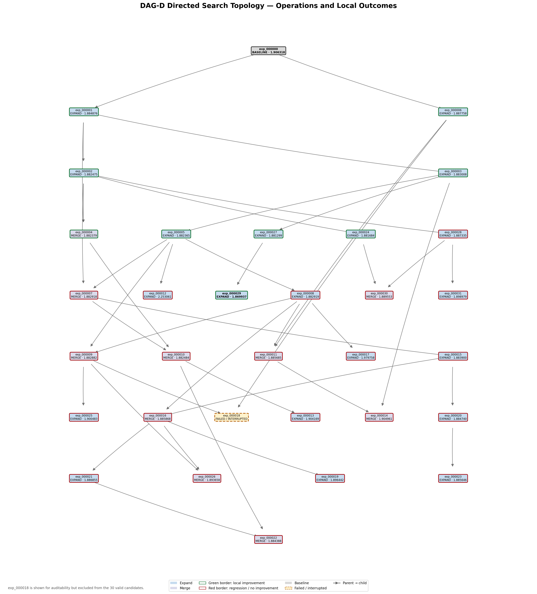
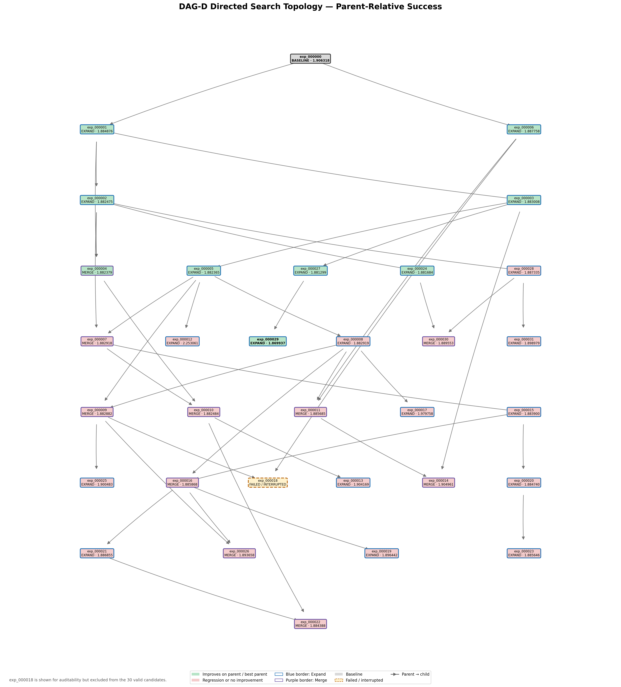
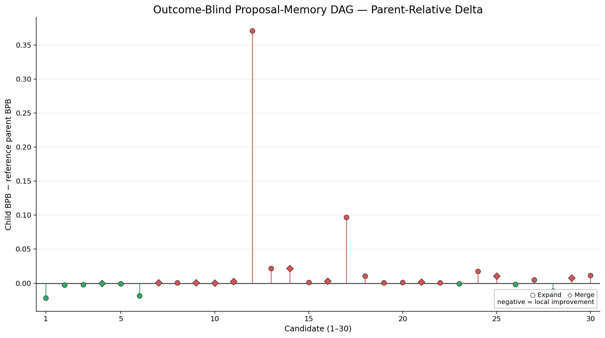
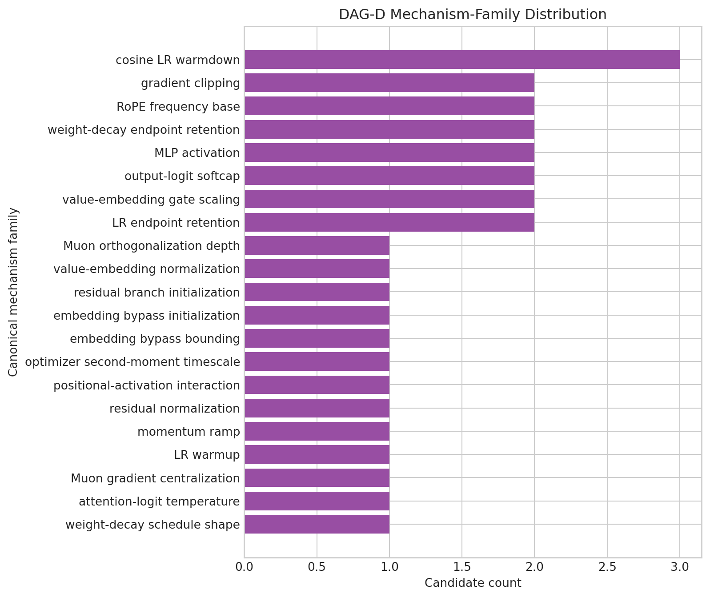
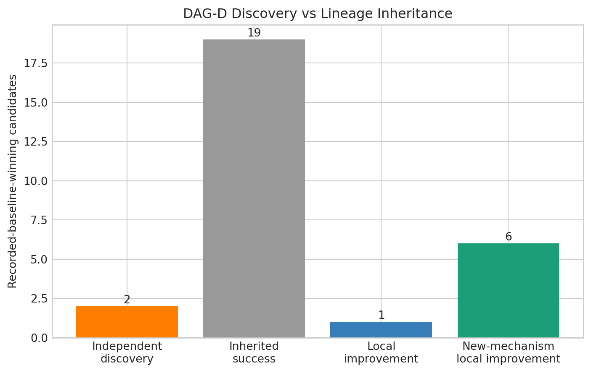

# Credit-Guided DAG-D: A History-Blind Proposal Experiment

## 1. What Is This Experiment?

AutoResearch is an automated model-improvement loop. An AI proposal agent edits the training code, the resulting model is trained for a fixed time budget, and the candidate is evaluated on held-out data. The evaluation metric in this experiment is validation bits per byte (`val_bpb`); lower values are better.

A simple automated search can form a single chain: modify the current best program, evaluate it, and repeat. DAG-D instead organizes candidates as a **directed acyclic graph (DAG)**. This preserves multiple lines of investigation. A promising idea can be developed further without forcing every later proposal to descend from the same most recent candidate.

DAG-D uses two operations:

- **Expand** selects one existing candidate as a parent and asks the proposal agent for one new modification. The child therefore has one incoming parent edge.
- **Merge** selects two existing candidates and asks the agent to construct a compatible child from both code states. The child has two incoming parent edges.

Parent selection is **credit-guided**. The orchestrator assigns credit using measured validation quality, evidence from direct-child improvements, and an exploration bonus. Higher-credit candidates are more likely to be selected, but selection remains probabilistic so that less-used branches can still be explored. For Merge, the same mechanism selects a pair of parents.

## 2. Why DAG-D?

There are two different ways in which past outcomes can influence this search:

1. The orchestrator can use measured results to select promising parents.
2. The proposal agent can be explicitly told which earlier proposals succeeded or failed.

DAG-D removes only the second channel. Its proposal prompt hides explicit historical outcome feedback such as `beat-parent=S`, `failed=N-S`, and descriptions of one Merge parent as the “better-result parent.” The credit-guided parent selector still uses performance.

The proposal agent also retains **exploration memory**: mechanism families, attempt counts, recent mechanism transitions, novelty classifications, anti-duplication guidance, retry information, parent hypotheses, and the current code, diff, and commit context. This memory helps it avoid blindly repeating proposals and understand the branch it is editing.

Therefore, **history-blind does not mean memoryless**. DAG-D hides labelled historical performance from proposal generation while preserving structural search history and outcome-conditioned lineage selection.

## 3. Experimental Setup

| Setting | Value |
|---|---:|
| Valid candidate target | 30 |
| Search operations | 20 Expand / 10 Merge |
| Workers | 1 (serial execution) |
| Hardware | One NVIDIA RTX 5070 Laptop GPU |
| Candidate proposal model | `gpt-5.6-luna` |
| Random seed | `AUTORESEARCH_SEED=42` |
| Training budget per candidate | `TRAIN_TIME_BUDGET=300.0` seconds |
| Agent watchdog | 1800 seconds |
| Evaluation metric | Validation bits per byte (`val_bpb`; lower is better) |
| Proposal retries | `K=3` |
| Final committed parent selections | `T=40` |

The run kept the training and evaluation procedure, baseline model code, RTX 5070 compatibility changes, credit calculation, parent and Merge-pair selection, retry and fallback behavior, semantic Merge validation, novelty controls, candidate accounting, and stopping rule fixed. Failed proposal or preparation attempts did not enter training, did not count as valid candidates, and did not increment `T`.

The stored credit parameters were `quality_scale=0.01`, `lambda_credit=0.5`, `gamma_explore=0.5`, and softmax `temperature=1.0`. The final `T=40` follows directly from 20 one-parent Expands plus 10 two-parent Merges.

## 4. How to Read the DAG

This figure is reconstructed from the recorded parent relationships in `dag.json`:

- The top node, `exp_000000`, is the recorded baseline.
- Every other valid node is a trained and evaluated candidate.
- An arrow means **parent → child**: the child was prepared from that parent.
- One incoming arrow identifies an Expand.
- Two incoming arrows identify a Merge; both real parents point to the same child.
- Moving downward follows the development of the search through increasing graph depth. It is not a plot of validation score over time.
- Node labels show the candidate ID and, where applicable, its `val_bpb`.

The graph includes all 30 valid candidates. It also shows `exp_000018` as a dashed failed/interrupted node. That reserved ID came from a proposal/preparation attempt interrupted before training, so it has no `val_bpb` and is not one of the 30 valid candidates.

## 5. Main Results

| Metric | Result |
|---|---:|
| Valid finished candidates | 30 |
| Expand / Merge | 20 / 10 |
| Recorded baseline | 1.906318 |
| Best candidate | `exp_000029` |
| Best `val_bpb` | **1.869937** |
| Improved over parent or best parent | 9/30 (30.0%) |
| Expand improved over parent | 8/20 (40.0%) |
| Merge improved over best parent | 1/10 (10.0%) |
| Canonical mechanism families | 21 |
| Repeated/refinement proposals | 9/30 (30.0%) |
| Preparation failures | 27 |
| Semantic rejects | 11 |
| Agent timeouts | 0 |

The search found its best result at `exp_000029`. This candidate expanded `exp_000027` with a bounded embedding-bypass mechanism and reduced `val_bpb` from 1.881299 to 1.869937.

*Figure intentionally omitted from the curated archive: Global best-so-far.*

The next plot shows every valid candidate in search order. It is useful for seeing the spread of absolute results, including occasional large regressions, but the recorded-baseline line should be interpreted with the caveat in Section 9.

*Figure intentionally omitted from the curated archive: Candidate validation loss.*

## 6. Success-Aware DAG

This graph has exactly the same topology as the previous DAG, but its success encoding is local:

- An Expand succeeds when its child has lower `val_bpb` than its single parent.
- A Merge succeeds only when its child has lower `val_bpb` than **both** parents—that is, lower than the better parent.
- A regression or tie is not counted as a local success.
- The interrupted `exp_000018` remains visually separate from trained candidates.

This parent-relative definition asks whether an operation added value at the point where it was applied. It does not classify success merely by comparing every descendant with the recorded root baseline.

## 7. What Actually Happened During Search?

### Expand produced most of the local gains

Eight of the 20 Expands improved on their parent. The early search produced two independent improvements directly from the baseline: `exp_000001` and `exp_000006`. Later improvements developed already-promising branches. In particular, `exp_000027` improved the branch rooted through `exp_000003`, and `exp_000029` then made the largest late local gain and became the overall best candidate.

*Figure intentionally omitted from the curated archive: Expand child versus parent.*

Even so, most individual operations did not improve locally. Across all operations, the median value of `best parent − child` was -0.000944, slightly on the regression side. The distribution below makes the mix of useful and unhelpful local changes visible.

### Merge usually inherited quality rather than adding combination gain

Only one of the ten Merges, `exp_000004`, beat its better parent. Its gain was small: it moved from a best-parent score of 1.882475 to 1.882379, an improvement of 0.000096. The other nine Merges did not produce positive combination gain. The largest Merge regression was `exp_000014`, which finished 0.021953 above its better parent.

*Figure intentionally omitted from the curated archive: Merge child versus best parent.*

Nine of the ten trained Merges implemented a canonical transition already represented elsewhere in the DAG. They were still valid Merges—they combined recorded code states and passed semantic checks—but in this run they mostly preserved or reintroduced existing mechanisms rather than producing a new beneficial interaction.

### Broad proposal coverage coexisted with repeated refinements

The 30 candidates cover 21 canonical mechanism families. The largest family, cosine learning-rate warmdown, contains 3/30 candidates, so no family accounts for more than 10% of proposals. Twenty-one candidates introduced a canonical family for the first time; nine were classified as repeats or refinements under the code-diff taxonomy.

This breadth shows that the retained exploration memory continued to support varied proposals. It does not imply that every novel mechanism was useful: some unique proposals regressed substantially, while some repeated proposals retained a strong inherited state.

### Most root-baseline wins were inherited

Relative to the recorded baseline, 28 candidates scored lower. Their origins were:

| Origin | Count |
|---|---:|
| Independent discovery | 2 |
| Inherited success without local improvement | 19 |
| Local improvement on an already successful lineage | 1 |
| New-mechanism local improvement | 6 |

Thus only 9 of those 28 candidates improved over their immediate parent or better Merge parent. The other 19 remained below the recorded baseline because they inherited an already strong ancestor, not because the current operation improved it.

The lineage rooted at `exp_000001` contains 27 of the 28 recorded-baseline wins. Removing that lineage leaves three candidates and one recorded-baseline win. Credit-guided selection therefore concentrated much of the later search on a successful early ancestry even though the proposal agent itself did not see explicit success/failure labels. `exp_000002`, `exp_000005`, and `exp_000008` were the most-used parents, with four selections each.

*Figure intentionally omitted from the curated archive: Parent usage.*

## 8. Proposal Diversity and Search Behavior

DAG-D did not collapse onto a single proposal family. It explored many mechanism types while repeatedly selecting several productive ancestors. These are distinct behaviors: the orchestrator exploited promising lineages through credit-guided parent selection, while the proposal agent used exploration memory to vary the mechanism applied to those lineages.

The resulting search was therefore broad in mechanism composition but concentrated in ancestry. Expand was the main source of measurable local progress. Merge preserved strong parent states often enough to produce competitive absolute scores, but rarely improved on the better input parent.

## 9. Important Baseline Caveat

DAG-D records a baseline `val_bpb` of **1.906318**, and 28/30 valid candidates score below that value. This is a descriptive fact about the recorded run, not evidence of 28 independent discoveries.

A later forensic audit and a separate four-run baseline calibration found that a nominal 300-second wall-clock training budget can produce different amounts of optimization: the observed calibration runs completed 20–23 optimization steps, with corresponding differences in token exposure and baseline `val_bpb`. The recorded baseline threshold is therefore sensitive to how much training actually fit inside the wall-clock budget.

For that reason, the 28/30 own-baseline win rate should not be interpreted as 28 genuine improvements or used as strict cross-run causal evidence. The more informative measures for this standalone trajectory are local comparisons made within the recorded DAG: Expand child versus parent, Merge child versus best parent, absolute `val_bpb`, and the distinction between independent discovery and inherited success.

## 10. Failure and Recovery

The run recorded 27 proposal/preparation failures and 11 semantic Merge rejects. These occurred before training and did not consume valid-candidate slots or increment `T`.

`exp_000018` was reserved during a Merge proposal/preparation attempt, then interrupted by a Codex/remote failure. It never entered `train.py` and produced no evaluation result. The orchestrator's existing recovery mechanism preserved the completed candidates, marked the interrupted reservation as failed, and continued with later IDs until it reached exactly 30 valid candidates.

An operational `--agent-timeout-seconds=1800` safeguard was subsequently added around the candidate-agent subprocess so that a stalled proposal can be terminated and handled as a recoverable preparation failure. No agent timeout occurred in the completed run, so this safeguard did not alter its candidate accounting or search results.

## 11. What Can We Conclude?

### What we observed

- DAG-D completed exactly 30 valid candidates using 20 Expands and 10 Merges.
- It found a best absolute result of 1.869937 at `exp_000029`.
- Nine operations improved locally: eight Expands and one Merge.
- Proposal generation covered 21 canonical mechanism families, while credit-guided selection concentrated later work in a successful early lineage.
- Most candidates below the recorded root baseline inherited that status rather than creating a new local improvement.
- Merge provided little added combination value in this trajectory: only one Merge beat its better parent, and that gain was 0.000096.

### What we cannot conclude

- This single-seed trajectory cannot establish that hiding explicit historical outcome feedback helps or harms search quality.
- The recorded-baseline win rate cannot be treated as a count of independent discoveries or as a clean comparison with another run.
- The weak observed Merge performance does not prove that Merge is generally ineffective; it was not replicated across seeds.
- Mechanism-family labels and lineage categories are reproducible analysis conventions, not intrinsic properties of the model.

## 12. Takeaways

1. A credit-guided DAG can continue to exploit promising ancestry even when explicit success/failure labels are hidden from the proposal agent.
2. History-blind proposal generation remained diverse because structural exploration memory was still available.
3. Expand drove nearly all local progress in this run: 8/20 Expands improved, compared with 1/10 Merges.
4. Inherited performance must be separated from genuine local improvement; 19 of 28 recorded-baseline wins did not improve on their parent.
5. Under a wall-clock training budget, parent-relative metrics are more trustworthy than treating a single recorded baseline threshold as a universal measure of discovery.
