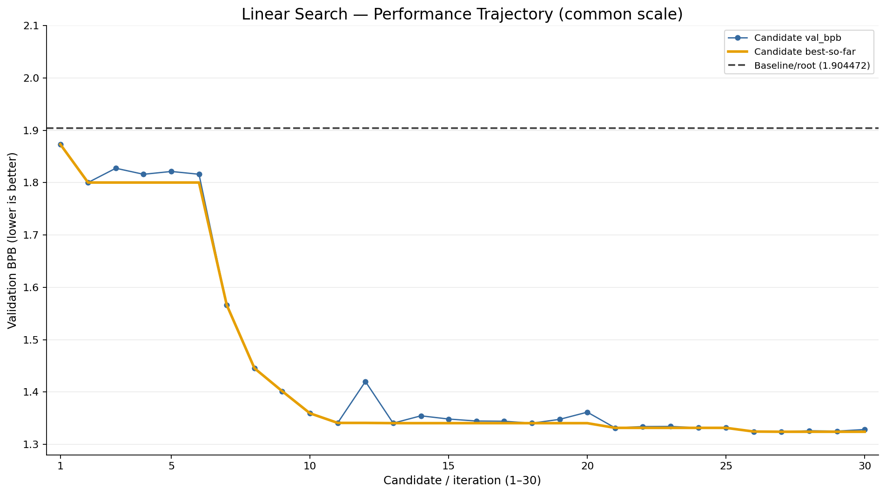
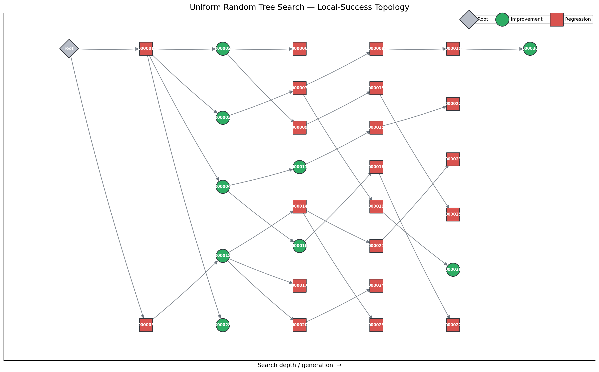
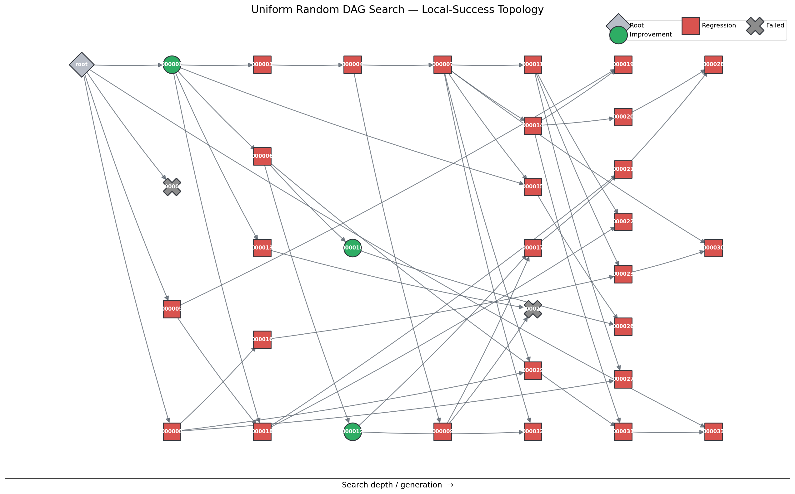
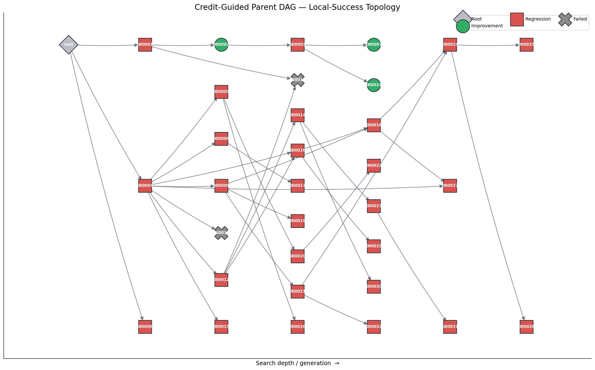
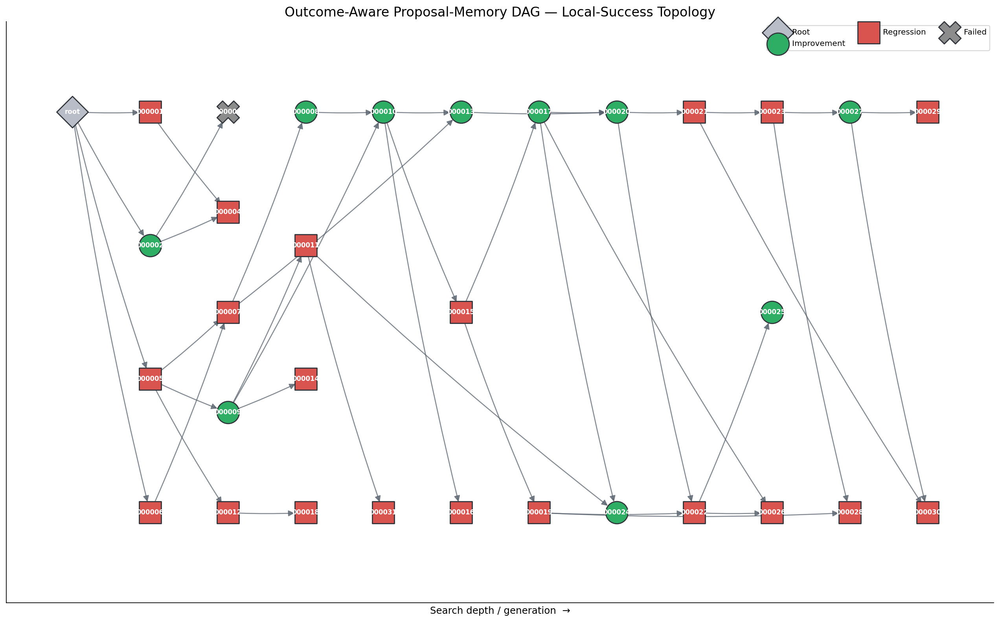
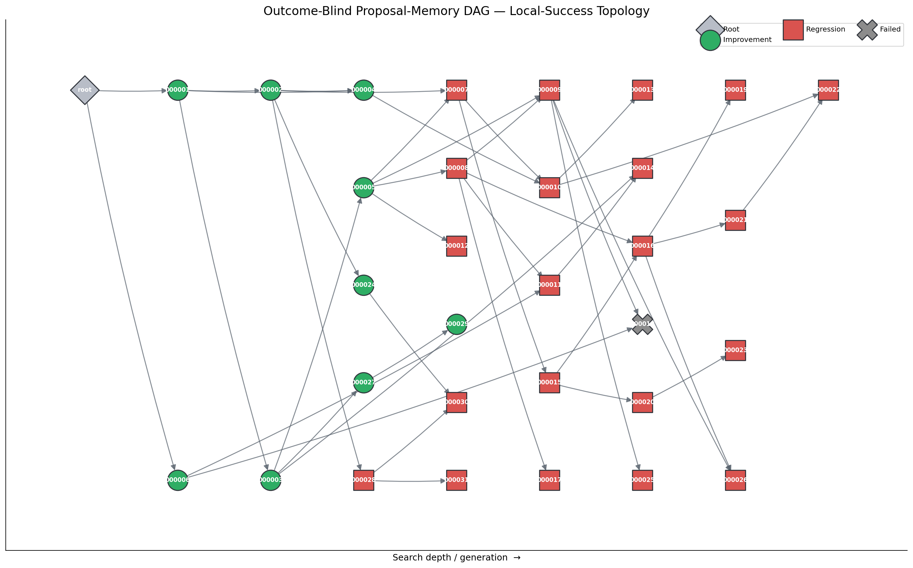

# Exploring DAG Search for Automated Research

## Technical Research Report v1

## 1. Abstract

Automated research systems can repeatedly edit a program, train and evaluate the edited candidate, and use the result to guide the next proposal. A natural implementation is linear: every accepted edit advances a single active trajectory, while unsuccessful edits are discarded. In our initial 40-iteration Linear Search, this process found large improvements early and then entered a much flatter regime. That observation motivated the central question of this study: **can retaining, revisiting, and recombining alternative edit trajectories change search behavior after a linear automated-research process begins to plateau?**

We investigated this question through a sequence of controlled search mechanisms. Uniform Random Tree Search retained historical candidates and allowed later proposals to branch from them. Uniform Random DAG Search added two-parent semantic Merge operations. Subsequent experiments studied credit-guided allocation of search opportunities, bounded retry of incompatible Merge pairs, online proposal memory and diversity guidance, and an outcome-feedback diagnostic in which explicit success/failure labels were removed from proposal generation while exploration memory was retained. With the exception of the original 40-iteration linear run, the main search experiments used 30 valid candidates. The repository's standardized Linear figure shows its first 30 iterations while preserving all 40 raw results.

The experiments do not support a monotonic ranking from Linear to Tree to progressively richer DAGs. Branching alone did not recover the recorded baseline in the Uniform Random Tree run. Merge was frequently rejected or failed to improve over its better parent. Credit-guided selection changed how search opportunities were allocated but did not by itself ensure better candidates. Proposal memory was associated with broader mechanism coverage and more local improvements in one trajectory, but the experiment was not replicated sufficiently to support a causal claim. The outcome-blind run remained structurally and mechanistically diverse, while most candidates below its recorded root baseline inherited that status from an early successful lineage rather than creating a new local improvement.

A later methodological audit revealed that nominally identical 300-second wall-clock training budgets could complete different numbers of optimizer steps and expose the model to different token counts. Four calibration runs completed 20, 21, 20, and 23 steps, with `val_bpb` spanning 1.888005–1.906045. We therefore treat cross-run own-baseline win rates and best-score differences as descriptive rather than causal evidence. The report emphasizes parent-relative improvement, within-run topology, lineage, Merge behavior, and proposal behavior. This is an exploratory empirical study, not a state-of-the-art claim and not evidence that DAG search universally outperforms linear search.

## 2. Motivation

The underlying AutoResearch loop gives a proposal agent a compact but real language-model training program. The agent edits the program—primarily `train.py`—and the candidate is trained and evaluated. The principal metric is validation bits per byte (`val_bpb`), where lower is better. The loop then decides what program state should receive the next research attempt.

The simplest policy maintains a single trajectory. A candidate is proposed from the current retained state, evaluated, and either kept or discarded. This policy has useful properties: its state is easy to understand, successful edits accumulate, and every new experiment is directly connected to the active program. It also creates a strong path dependence. Once one idea is retained, later proposals are normally developed in that context. A discarded or merely non-best historical state is no longer an active site for exploration, even if it represented a distinct mechanism that could have become useful after further development.

Our Linear Search contained 40 completed experimental iterations in addition to its baseline. It began at `val_bpb = 1.904472` and reached 1.320959 by iteration 40. The improvement was not uniform. Large early changes—especially batch-size and model-depth changes—moved the trajectory rapidly. The later portion concentrated on smaller architectural and optimization refinements near a much flatter frontier. Within the standardized first-30 view, the best value was 1.324037 at iteration 27; the final ten iterations produced only a further 0.003078 improvement, reaching 1.320959 at iteration 40.

The figure displays 30 iterations for consistency with the later 30-candidate experiments. The original experiment was not a 30-iteration run: it contained 40, and the repository retains the complete result table and original trajectory figure. Nor should the late flattening erase the success of the early search. Linear Search was an effective mechanism for finding substantial early gains in this setting. The plateau instead raised a new search-design question:

> Can retaining, revisiting, and recombining alternative edit trajectories change search behavior after a linear autoresearch process begins to plateau?

Three possible interventions follow from that question. First, the system can revisit historical candidates rather than always continuing one active chain. Second, it can preserve multiple lineages instead of collapsing every useful idea into a single state. Third, it can recombine modifications from separate lineages. Tree and directed acyclic graph (DAG) representations provide these structural capabilities, but structure creates additional questions: which historical candidates should receive budget, which branches are compatible, and whether the proposal process actually produces distinct ideas.

## 3. Experimental Evolution

### 3.1 Linear Search

**Previous limitation.** There was no previous stage; this experiment established the initial behavior. Its structural limitation is the use of one retained trajectory.

**Mechanism.** Each proposal edited the current retained program. A lower `val_bpb` could advance the retained state; unsuccessful proposals were discarded. There was no branching or multi-parent operation.

**Setup.** The run completed 40 iterations. For standardized visualization, this report shows iterations 1–30 and states “30 shown / 40 total.” The full raw results remain the authoritative record.

**Observation.** Search improved rapidly early and more slowly later. The baseline was 1.904472, the first-30 best was 1.324037, and the full-run best was 1.320959. This is a productive trajectory with a plateau-like late regime, not a failed baseline.

**What it does not prove.** A single adaptive run cannot establish that all linear automated research will plateau at the same point, or that branching would improve the same program if introduced earlier or later.

### 3.2 Uniform Random Tree Search

**Previous limitation.** Linear Search could not return to alternative historical candidates once the active trajectory moved elsewhere.

**Mechanism.** Uniform Random Tree Search retained every finished candidate with a finite result as an eligible parent. Each new candidate was an Expand with exactly one parent, selected uniformly. There was no quality weighting, pruning, inactivity removal, or Merge. The resulting topology records multiple single-parent lineages.

**Setup.** One serial worker produced 30 valid candidates from a recorded root baseline of 1.885642 under the nominal 300-second candidate-training protocol. The final state contained the root plus 30 valid candidates and no failed nodes.

**Observation.** The best candidate was `exp_000003` at 2.002502. None of the 30 candidates beat the recorded root baseline. Nine candidates improved over their own parent, showing that local recovery could occur within branches, but the global best including the root remained the baseline throughout this run. Branching alone did not solve the problem in this trajectory.

**What it does not prove.** This run does not show that tree search is generally worse than linear search. It is a single stochastic trajectory with a different experimental state and a small budget. It shows only that uniform branching, by itself, was insufficient here.

### 3.3 Uniform Random DAG Search

**Previous limitation.** A tree can preserve and revisit branches, but each child descends from only one parent. It cannot explicitly construct a candidate from two separate lineages.

**Mechanism.** Uniform Random DAG Search introduced two operations. Expand selected one finished parent. Merge selected two distinct parents and asked the proposal agent to determine whether their changes were semantically distinct and compatible; an accepted Merge synthesized one coherent `train.py`. The operation intent was sampled 50/50, and parents or untried pairs were selected uniformly. A Merge child had two incoming edges in both the stored DAG and Git commit topology.

**Setup.** The completed run contained 30 valid candidates: 15 Expands and 15 Merges. Two failed nodes remained in the state for auditability, and 20 rejected Merge pairs were recorded. The root baseline was 1.885642.

**Observation.** The best candidate was `exp_000001` at 1.879146. Three candidates were below the recorded root baseline. Under the stricter local definition used throughout this report, three of 30 candidates improved on their reference parent: all three were Expands, while none of the 15 Merges beat its better parent. The experiment successfully produced a multi-parent search topology, but richer topology did not make recombination reliably productive.

**What it does not prove.** The result does not establish that Merge is ineffective in general. Pair selection was uniform, the proposal agent had limited information about prior mechanisms, and the sample contained only 15 completed Merges.

### 3.4 Credit-Guided Parent DAG

**Previous limitation.** Once a DAG retains many finished nodes, uniform sampling treats promising, unpromising, frequently used, and barely explored nodes alike. Preserving alternatives enlarges the search space but does not decide where additional budget should go.

**Mechanism.** Credit-Guided Parent DAG replaced uniform parent selection with stochastic credit-softmax selection. Credit combined current node quality, mean improvement among the node's direct valid children, and an exploration bonus based on how often the node had been used. The 50/50 Expand/Merge intent remained. All finished finite-result nodes remained eligible; there was no hard pruning or inactivity removal. For a Merge, two parents were selected without replacement using the credit distribution, conditioned on the pair being untried. A semantic rejection still ended that Merge intent.

**Setup.** The run completed 30 valid candidates: 26 Expands and four Merges. Two failed nodes remained in the state. There were 36 Merge attempts, of which 31 were semantically rejected; only four reached training. The root baseline was 1.885642.

**Observation.** The best candidate was `exp_000004` at 1.895905, and no candidate beat the root baseline. Three of 30 candidates improved locally, all Expands. None of the four completed Merges beat its better parent. Twenty-nine of 30 finished proposals concerned the `MATRIX_LR` lineage, according to the experiment audit. Credit altered allocation—`exp_000004`, for example, was used seven times—but node-level credit did not solve pair compatibility or proposal concentration.

**What it does not prove.** The run does not causally compare credit selection with uniform DAG selection. They are separate adaptive trajectories. It also does not show that the credit formula is intrinsically poor: the proposal population was unusually homogeneous, limiting what any parent allocator could combine.

### 3.5 Merge-Retry Credit-Guided DAG

**Previous limitation.** In the preceding experiment, one incompatible pair could consume an entire Merge intent. Node-level quality credit did not imply pair-level semantic compatibility.

**Mechanism.** Merge-Retry Credit-Guided DAG retained the same credit formula, eligibility policy, 50/50 operation intent, and no-pruning behavior. For each Merge intent, it froze the eligible nodes and credit distribution, sampled a pair, and—after rejection—removed that exact pair and resampled without replacement. It allowed at most three pair attempts. If the pair pool or retry budget was exhausted, the operation fell back to an Expand selected from the same frozen credit distribution.

**Setup.** Thirty valid candidates completed: 18 Expands and 12 Merges. Nineteen Merge intents produced 24 semantic rejects, 12 completed Merges, six fallback Expands, and one quota-stopped intent that was rolled back without a candidate. The root baseline was 1.885642.

**Observation.** The conversion from Merge intent to completed Merge increased from 4/36 in the preceding run to 12/19 here. This is direct evidence that bounded resampling reduced execution-level Merge starvation in these runs. It did not imply optimization success: the best candidate was 1.890996, none beat the root baseline, two of 18 Expands improved on their parent, and one of 12 Merges improved on its better parent. The completed Merge improvement was small (`exp_000025`, 0.000305 BPB relative to its better parent).

**What it does not prove.** The higher number of completed Merges does not prove that retry improves model quality. It changes which operations reach training, but the runs are not paired replicates and most completed Merges still regressed locally.

### 3.6 Outcome-Aware Proposal-Memory DAG

**Previous limitation.** Merge retry improved structural execution, but proposals still concentrated on a narrow family of modifications. Multiple stored nodes did not automatically mean multiple proposal mechanisms.

**Mechanism.** Outcome-Aware Proposal-Memory DAG retained credit-guided selection and bounded Merge retry/fallback. It added structured proposal metadata, online memory of mechanism families and effective transitions, explicit diversity guidance, a conservative novelty/preparation check, and proposal retries. Crucially, the proposal memory exposed family attempt counts together with parent-relative outcome summaries such as `beat-parent` and failure counts. It was therefore outcome-aware at proposal time.

**Setup.** The run contained 30 valid candidates: 20 Expands and ten Merges, plus one failed preparation node. Sixteen semantic Merge rejects and 22 preparation rejects were recorded. The proposal layer made 69 attempts across 32 operation records. The root baseline was 1.885642.

**Observation.** The best candidate was `exp_000027` at 1.855929. Ten candidates improved locally: six of 20 Expands and four of ten Merges. The audit identified 18 canonical mechanism families among the 30 valid candidates. Twenty-two candidates fell below the recorded root baseline, but the methodological caveats in Section 9 prevent treating this count as a clean cross-run effect. Within the run, the parent-relative results and broader recorded mechanism coverage show that productive local changes and varied proposals coexisted in this trajectory.

**What it does not prove.** This intervention bundled memory, metadata, diversity instructions, validation, and retries. A single run cannot identify which component caused the observed proposal distribution or local improvement rate. Differences from the preceding run are suggestive, not a causal estimate.

### 3.7 Outcome-Blind Proposal-Memory DAG

**Previous limitation.** The previous proposal agent saw both exploration history and explicit outcome labels. This made it unclear whether mechanism memory alone could support diverse exploration, and whether labelled success/failure feedback was necessary.

**Mechanism.** Outcome-Blind Proposal-Memory DAG removed per-family `beat-parent` and failure counts from the proposal-memory summary. It also stopped describing the Merge checkout as the “better-result parent,” using “selected base parent” instead. It retained mechanism families, attempt counts, transitions, novelty classifications, retry context, current code and diffs, and structural history. Credit-guided parent selection still used measured outcomes. Thus outcome-blind does not mean history-blind, memoryless, or outcome-independent search.

**Setup.** The run completed 30 valid candidates: 20 Expands and ten Merges. One interrupted preparation node, `exp_000018`, remains failed in the DAG and is excluded from the valid count. The run recorded 27 preparation failures, 11 semantic rejects, and no agent timeout. Its root baseline was 1.906318.

**Observation.** The best candidate was `exp_000029` at 1.869937. Nine candidates improved locally: eight Expands and one Merge. The analysis identified 21 mechanism families, with nine proposals classified as repeats or refinements. Twenty-eight candidates were below the run's recorded root baseline, but only nine improved on their own parent or better Merge parent. Nineteen of those 28 root-baseline wins were inherited successes: they stayed below the root threshold because they descended from an already successful lineage, not because the current operation improved locally. The lineage rooted at `exp_000001` contained 27 of the 28 root-baseline wins.

**What it does not prove.** The experiment is a diagnostic trajectory, not the “final strongest model.” The outcome-aware and outcome-blind runs have different baseline provenance and are unreplicated. Their absolute scores and root-baseline win counts cannot identify the causal effect of outcome feedback.

## 4. Credit Allocation

Branching changes the allocation problem. In a linear trajectory, there is usually one obvious place to spend the next experiment: the retained state. A DAG may preserve dozens of finished nodes, each representing a different quality level, lineage depth, mechanism, and usage history. Retention makes alternatives available but also dilutes a fixed candidate budget.

The credit-guided experiments represented each eligible node (v) using three quantities. Let (L_v) be its `val_bpb`, (L_{best}) the lowest loss among eligible nodes, and the quality scale be 0.01. The quality term was

\[
Q(v) = \frac{L_{best} - L_v}{0.01}.
\]

Because lower loss is better, the current best node has (Q=0) and worse nodes have negative quality. A downstream-contribution term (E(v)) averaged the scaled improvements of the node's finished valid direct children. If a child achieved a lower loss than its parent, that observation contributed positively. Nodes without valid children received (E=0). The exploration term was

\[
H(v) = \sqrt{\frac{\log(T+1)}{n_v+1}},
\]

where (T) is the total number of committed parent selections and (n_v) is the number of times node (v) had been used. Final credit was

\[
C(v) = Q(v) + 0.5E(v) + 0.5H(v),
\]

followed by softmax sampling with temperature 1.0.

This design is not simply “choose the current best candidate.” A node whose own score is not globally best can receive positive downstream credit if it repeatedly produces useful children. Conversely, a good node does not receive unlimited deterministic exploitation because selection remains stochastic and underused nodes receive exploration credit. Parent-use counters were committed only after candidate preparation succeeded, avoiding credit consumption by rejected preparation attempts.

The observed results motivate, rather than settle, the allocation problem. Credit-Guided Parent DAG concentrated budget non-uniformly, but its proposal population largely varied one learning-rate parameter. Merge-Retry Credit-Guided DAG improved the conversion of Merge intents without producing many parent-relative gains. Future credit systems may need multi-generation contribution, compatibility information, mechanism-level diversity, or uncertainty estimates. Those extensions were not evaluated here.

## 5. Merge and Recombination

A tree preserves alternatives but cannot combine them: every candidate has one incoming parent. A DAG permits a two-parent candidate. In these experiments, Merge was semantic rather than a raw textual or Git merge. The proposal agent received two parent states, hypotheses, and a direct code diff. It could reject the pair as redundant or conflicting, or synthesize a coherent child program. An accepted child was recorded with two parents.

We define local Merge success conservatively. If parents have losses (L_1) and (L_2), the reference is their better value, \(\min(L_1,L_2)\). A Merge succeeds locally only when

\[
L_{child} < \min(L_1,L_2).
\]

Beating the worse parent is insufficient because the child could simply inherit the better parent's state. The unified parent-relative plots use

\[
\Delta = L_{child} - \min(L_1,L_2),
\]

so negative values denote improvement.

Merge was not a stable source of gain in these runs. Uniform Random DAG Search completed 15 Merges and none beat its better parent. Credit-Guided Parent DAG completed only four because 31 of 36 attempts were rejected, and none of the four improved locally. Merge-Retry Credit-Guided DAG increased completed Merges to 12, but only one improved locally. Outcome-Aware Proposal-Memory DAG recorded four local Merge improvements out of ten, while Outcome-Blind Proposal-Memory DAG recorded one out of ten.

These observations expose two separate bottlenecks. **Feasibility** asks whether two selected branches contain distinct, compatible mechanisms that can be synthesized. **Usefulness** asks whether a valid synthesis improves over the better input. Retry addressed feasibility at the scheduling level by offering additional pairs, but did not guarantee usefulness. Proposal memory broadened the mechanisms available in one trajectory, yet most Merges across the full study still did not add measurable local value. This motivates better compatibility models and synthesis procedures; it does not justify a universal claim that Merge cannot work.

## 6. Proposal Diversity and Memory

Structural diversity and proposal diversity are different. A DAG can contain many nodes and edges while the proposal agent repeatedly changes the same parameter. Such a graph has topological breadth but limited mechanistic breadth. This distinction became visible in the credit-guided experiments. Credit-Guided Parent DAG had multiple lineages, yet 29 of 30 finished proposals were associated with the `MATRIX_LR` lineage. Merge-Retry Credit-Guided DAG improved the number of executable Merges, but its audit still found strong concentration around learning-rate warmdown variants.

Outcome-Aware Proposal-Memory DAG addressed the proposal layer. Each accepted proposal supplied a family, mechanism, effective transition, summary, and mechanistic justification. The online memory summarized mechanisms already attempted and their parent-relative outcomes. Diversity instructions asked for genuinely distinct changes, while novelty and preparation checks rejected malformed or redundant proposals before training. Retries gave the proposal layer another chance without counting a rejected preparation as a valid candidate.

The completed run contained 18 canonical mechanism families. Its largest categories were not dominant in the way the preceding warmdown-focused run had been. Ten of 30 candidates improved locally. These results are consistent with the hypothesis that explicit memory and diversity guidance can change proposal behavior, but they are not an isolated causal test: several proposal-layer mechanisms changed together, and only one trajectory was run.

Outcome-Blind Proposal-Memory DAG retained the exploration portion of memory while removing explicit outcome counts. It still recorded 21 mechanism families, with the largest family containing three candidates and nine proposals classified as repeats or refinements. In this run, mechanism breadth did not require exposing explicit success counts to the proposal agent. However, comparing 18 versus 21 families across two single trajectories is descriptive; it does not establish that removing feedback increases diversity.

## 7. History-Feedback Diagnostic

The central diagnostic question was:

> What changes when explicit historical outcome feedback is removed from proposal generation while exploration memory is retained?

The important distinction is between two outcome channels. The orchestrator used measured results to choose parents through credit. The proposal agent could separately be told how past proposal families performed. Outcome-Blind Proposal-Memory DAG removed only the second channel. As a result, later search could still concentrate on successful ancestry even though the proposal prompt did not label past mechanisms as successful or failed.

The run illustrates this separation. Proposal generation covered 21 mechanism families, suggesting that exploration memory continued to support broad mechanism coverage. At the same time, credit-guided allocation concentrated ancestry: 27 of the 28 candidates below the root baseline belonged to the lineage rooted at `exp_000001`. Eight of 20 Expands improved on their parent, but only one of ten Merges improved on its better parent. Most root-baseline wins were inherited rather than newly created.

This diagnostic should not be read as a direct performance contest with Outcome-Aware Proposal-Memory DAG. Their historical baselines were 1.885642 and 1.906318, respectively, and later calibration showed that these thresholds were not exchangeable. The useful evidence is internal: topology, which parents received later work, how often operations improved locally, which proposal mechanisms appeared, and whether root-baseline success was newly discovered or inherited.

## 8. Unified Visualization

The repository regenerates all main figures from stored results with a common visual language. Performance plots use candidates or iterations 1–30, a shared 1.28–2.10 y-axis for the common-scale view, and separate local-scale versions where DAG-level differences would otherwise be visually compressed. The line for candidate `val_bpb` is accompanied by candidate best-so-far and a clearly labelled root/baseline reference.

For every experiment with parent topology, search proceeds left to right from root to increasing graph depth. Every valid candidate appears. Expand nodes have one incoming source edge; Merge nodes have two. Failed or interrupted reservations are retained where they exist and never counted among the 30 valid candidates. A separate edge audit verifies that every plotted edge exists in the stored `dag.json`, every valid node is present, and no edge was invented.

Success-aware topology uses one definition across all parent-structured experiments:

- neutral diamond: root/baseline;
- green circle: local improvement;
- red square: no local improvement or regression;
- gray X: failed/interrupted node;
- light or hollow styling: unknown result, if present.

Green never means “below this run's root baseline.” For an Expand it means the child is below its parent. For a Merge it means the child is below both parents, equivalently below the better parent. This distinction prevents inherited success from being drawn as a new discovery. The topology figures are structural explanations, not performance rankings: denser graphs can preserve more relationships while still producing few local improvements.

## 9. Methodological Audit and Baseline Calibration

During analysis, we initially explored a direct comparison between the outcome-aware and outcome-blind runs. That comparison exposed a baseline-provenance mismatch. Both runs used a nominal 300-second training-time budget, but their recorded root baselines were substantially different. Rather than present the difference as an algorithmic effect, we performed a separate calibration using byte-identical baseline `train.py` and `prepare.py`, the same seed, dataset, model, optimizer, and nominal hardware configuration.

Four serial calibration runs produced:

| Run | Optimizer steps | Tokens processed | `val_bpb` |
|---:|---:|---:|---:|
| 1 | 20 | 10,485,760 | 1.906045 |
| 2 | 21 | 11,010,048 | 1.902874 |
| 3 | 20 | 10,485,760 | 1.905279 |
| 4 | 23 | 12,058,624 | 1.888005 |

The observed `val_bpb` range was 0.018040. The two 20-step runs were close: 1.906045 and 1.905279, a difference of 0.000766. The 23-step run was much lower at 1.888005. The 21-step result lay between those regimes at 1.902874. With 524,288 tokens per optimizer step, completing 20 versus 23 steps changed token exposure by 1,572,864 tokens.

This calibration establishes a concrete protocol issue: a fixed wall-clock budget does not imply fixed optimization exposure. Step duration, compilation and synchronization boundaries, and the loop's timing behavior determine how many complete optimizer updates fit into the nominal budget. The resulting token exposure and schedule progression materially affect BPB.

Consequently, cross-run own-baseline win rates should not be interpreted as strict causal comparisons. For example, the 28/30 root-baseline win count in Outcome-Blind Proposal-Memory DAG is a descriptive property of its recorded trajectory and threshold, not 28 independent discoveries and not evidence that it outperformed the outcome-aware experiment. The final analysis therefore gives more weight to parent-relative improvement, within-run comparisons, topology, lineage, and proposal behavior. Even parent-relative comparisons retain ordinary run-noise caveats, particularly for very small deltas, but they avoid using a separately measured root threshold as the definition of every later operation's success.

## 10. Results

The table summarizes the standardized 30-candidate view. It is organized by research question, not by winner. “Local improvements” means adjacent-iteration decrease for Linear Search, child below parent for Tree/Expand, and child below the better parent for Merge.

| Experiment | Structure | N | Expand | Merge | Local improvements | Best BPB | Primary question |
|---|---|---:|---:|---:|---:|---:|---|
| Linear Search | Single adaptive chain | 30 shown / 40 total | — | — | 20/30 adjacent decreases | 1.324037 first-30; 1.320959 full run | What does sequential keep/discard search find, and where does it flatten? |
| Uniform Random Tree Search | Single-parent tree | 30 | 30 | 0 | 9/30 | 2.002502 | Is branching alone useful? |
| Uniform Random DAG Search | Uniform multi-parent DAG | 30 | 15 | 15 | 3/30 | 1.879146 | What changes when branches can be recombined? |
| Credit-Guided Parent DAG | Credit-selected DAG | 30 | 26 | 4 | 3/30 | 1.895905 | Which historical nodes should receive more search budget? |
| Merge-Retry Credit-Guided DAG | Credit DAG with pair retry/fallback | 30 | 18 | 12 | 3/30 | Can bounded pair resampling reduce Merge starvation? |
| Outcome-Aware Proposal-Memory DAG | Credit DAG with outcome-labelled proposal memory | 30 | 20 | 10 | 10/30 | Can proposal memory broaden mechanisms and reduce proposal collapse? |
| Outcome-Blind Proposal-Memory DAG | Credit DAG with outcome labels hidden from proposals | 30 | 20 | 10 | 9/30 | What remains when explicit outcome feedback is removed from proposal generation? |

The best BPB values should not be sorted into an algorithm ranking. Linear Search used a substantially different trajectory and reached a different model regime. The DAG experiments are separate adaptive paths, mostly single seed, and their root baselines are not always exchangeable. The table supports statements about what happened in each run and which mechanism was exercised; it does not estimate a general treatment effect.

## 11. Negative Results

Negative results were central to the evolution of the project:

- Uniform branching did not automatically escape the problem. Uniform Random Tree Search produced local recoveries but no candidate below its recorded root baseline.
- Branching alone was insufficient in that run. Preserving more candidates did not decide which ones deserved scarce experiments.
- Merge frequently failed before training. Credit-Guided Parent DAG rejected 31 of 36 Merge attempts because the selected changes were redundant, conflicting, or ancestry-related.
- More completed Merges did not guarantee better candidates. Merge retry increased completed Merges from four to twelve across the relevant runs, but only one of those twelve improved over its better parent.
- Richer topology did not guarantee optimization gain. Uniform Random DAG Search created a valid multi-parent graph, but none of its 15 Merges improved locally.
- Proposal populations could collapse even in a multi-node DAG. One credit-guided run concentrated 29 of 30 finished proposals around a single learning-rate lineage.
- Explicit historical outcome feedback cannot be assigned a strong causal effect from the two proposal-memory trajectories. They are single runs with a baseline-provenance confound and bundled implementation differences.

These findings are not implementation embarrassments to hide. They identify where structural search creates new research problems: allocation, compatibility, synthesis, proposal generation, and evaluation.

## 12. Discussion

### A. Preserving alternatives is easy; allocating search is hard

A tree or DAG can retain every completed state with straightforward bookkeeping. The difficult question is what to do with those states under a small experiment budget. Uniform selection avoids premature commitment but may repeatedly develop poor branches. Credit-guided selection uses more information, yet its usefulness depends on proposal quality and how contribution is measured.

### B. Branching alone is insufficient

Uniform Random Tree Search observed nine local improvements, so its branches were not entirely inert. Nevertheless, no candidate recovered the root baseline. In this run, structural branching without better allocation or proposal control did not solve the search problem.

### C. Recombination creates opportunities and compatibility problems

Multi-parent candidates make a qualitatively new operation possible, but they require two compatible mechanisms and a synthesis that adds value beyond the better input. The experiments observed semantic rejection, pair starvation, fallback behavior, and completed Merges that mostly inherited or degraded parent quality. Merge retry addressed access to compatible pairs, not the deeper synthesis problem.

### D. Credit can reflect downstream contribution, not only immediate quality

The implemented credit formula allowed a parent to benefit when its direct children improved, even if the parent was not currently best. This is a useful conceptual shift from node quality to research productivity. The present data show that the mechanism operated, but do not establish the best weighting or propagation depth. Direct-child averaging may miss delayed multi-generation contribution.

### E. Structural diversity and proposal diversity are different

A graph with many nodes may still contain repeated scalar refinements. Proposal memory targeted this distinction by recording mechanisms and transitions rather than only nodes and scores. The later runs observed broader family coverage, suggesting that proposal-level state deserves independent design attention.

### F. Evaluation protocol is part of the search algorithm

Under a wall-clock budget, code changes and runtime variability can change the number of optimizer steps and tokens seen. A search policy may then appear to improve because a candidate received more effective optimization exposure. Calibration showed that this issue was large enough to affect the scale of cross-run differences. Reliable automated research requires treating budget enforcement and exposure accounting as experimental variables, not invisible infrastructure.

## 13. Limitations

This study has substantial limitations:

- **Single GPU.** The experiments were executed on one NVIDIA RTX 5070 Laptop GPU. Hardware-specific throughput and memory behavior may shape the search landscape.
- **Mostly single seed.** Search and proposal generation were not replicated across enough random seeds to estimate variance or algorithm-level effects.
- **Small candidate budgets.** Thirty valid candidates are sufficient to inspect mechanisms but small for comparing adaptive search policies.
- **Adaptive trajectories.** Each candidate depends on earlier choices. Candidate observations are not independent samples, and two runs do not visit the same states.
- **Wall-clock training budget.** Nominally identical 300-second budgets produced 20–23 optimizer steps in calibration, changing token exposure and schedule progression.
- **Limited statistical power.** No statistical significance claims are made. Counts such as 4/10 versus 1/10 Merge improvements are descriptive.
- **Model-specific behavior.** The findings come from one compact language-model training setup and may not transfer to other architectures, datasets, or objectives.
- **Merge compatibility.** Semantic compatibility was judged by the proposal agent and validation logic. This process may reject useful combinations or accept weak syntheses.
- **Proposal-agent stochasticity.** The candidate generator is itself stochastic and may respond sensitively to prompt context, code state, or transient failures.
- **Bundled interventions.** The outcome-aware proposal-memory experiment changed memory, metadata, diversity guidance, validation, and retry behavior together.
- **Analysis conventions.** Mechanism-family and lineage labels are reproducible audit constructs, not intrinsic properties of candidates.
- **Small deltas.** Some parent-relative gains are tiny and may be comparable to ordinary training noise; the study lacks repeated evaluation of every candidate.

## 14. Future Work

The next experiments should improve identification as well as search:

1. **Fixed-step or fixed-token evaluation.** Replace or complement wall-clock stopping so every candidate receives known optimizer and token exposure.
2. **Paired seeds.** Repeat each policy across shared search and training seeds, and report trajectory-level variability.
3. **Frozen-context replay.** Present different proposal policies with the same parent states and recorded context to isolate proposal-memory effects.
4. **Larger search budgets.** Test whether branching and recombination become more useful when lineages have time to mature.
5. **Improved Merge compatibility.** Learn or explicitly model whether two code changes affect distinct, composable mechanisms before spending proposal and training budget.
6. **Better synthesis checks.** Verify that both parent mechanisms are actually represented in a Merge child and distinguish inheritance from interaction gain.
7. **Multi-generation credit.** Propagate downstream success beyond direct children, with safeguards against one early lineage monopolizing budget.
8. **Diversity-aware selection.** Combine quality credit with mechanism coverage or uncertainty rather than relying only on proposal prompts for diversity.
9. **Ablate proposal-memory components.** Separately test mechanism memory, outcome labels, novelty filtering, diversity instructions, and retry count.
10. **Multi-GPU asynchronous search.** Study scheduling and stale-state effects when multiple candidates are prepared and evaluated concurrently.

These are proposed directions, not completed results.

## 15. Conclusion

Linear Search showed rapid early gains followed by a much flatter late regime. This motivated an investigation of whether alternative edit trajectories could be retained, revisited, and recombined. Tree and DAG representations provided those capabilities, but richer structure alone did not guarantee better optimization. Uniform branching did not solve the problem in its run. Merge created a meaningful multi-parent operation but also introduced pair-selection, compatibility, and synthesis bottlenecks. Credit-guided allocation made search budget responsive to node quality, downstream child improvement, and exploration, yet could not compensate for a homogeneous proposal population. Proposal memory shifted attention from graph structure to mechanism diversity and historical information.

The outcome-feedback diagnostic further separated ancestry selection from proposal context: the orchestrator could exploit successful lineages even when explicit outcome labels were hidden from the proposal agent. At the same time, lineage analysis showed why root-baseline wins should not be confused with independent discoveries. Finally, baseline calibration demonstrated that the evaluation protocol itself introduced meaningful variation in optimization exposure.

The strongest conclusion is therefore not “DAG beats Linear.” It is that automated research changes character when it moves from one trajectory to a retained search graph. The central problems become search allocation, downstream credit, proposal diversity, recombination quality, lineage interpretation, and reliable evaluation. The present work is an exploratory empirical study of those mechanisms and their failure modes.
